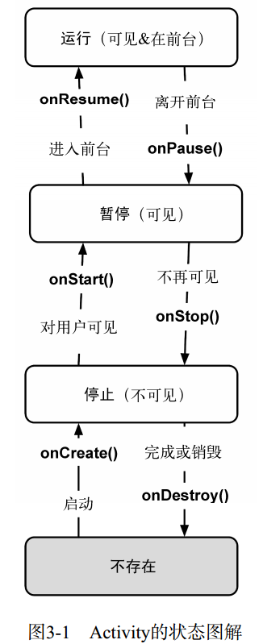

# Android笔记

我学习Java的唯一目的就是为了Android服务，我希望可以开发一个应用，我希望可以控制硬件，windows应用也好，android应用也好，ios应用也好，但是windows的开发环境大到恐怖，ios的开发又需要MAC，所以我只能选择android

### 准备开发环境

首先我们必须在电脑上安装JDK，这个在java里面已经处理过了，我选择的开发环境是Android Studio，直接去官网下载，然后安装就好，安装的过程中并没有太多的讲究和困难，安装完成之后，打开还会给你继续安装SDK之类的。然后我们就可以创建一个项目了，可能要做一些选择，例如我们要选择一个什么形式的应用，暂时只需要选择空白的就可以。

如果桌面上没有生成图标，我们可以通过`Android/bin/studio64.exe`来开启应用

然后当我们打开第一个应用的时候会遇到第一个问题所在，界面可能会卡在`Building xxx Application project info`类似的页面打不开，这是因为创建这个信息的过程中会使用一个叫做gradle的东西，默认会从谷歌下载，所以，你懂的，这是我们需要关掉软件，找到刚才创建的项目所在的文件夹，在它的`gradle\wrapper`里面找到`gradle-wrapper.properties`的配置文件，用sublime打开，他的最后一行是`distributionUrl=https\://services.gradle.org/distributions/gradle-3.3-all.zip`，这个指定了我们需要的gradle的版本，自己找个合适的地方去下载与要求完全一致的版本就好。

然后，不论你在安装的过程中选择的是什么文件夹，也不管你在哪里创建的工程，你总是可以在`C:\Users\stan han`找到一个名为`.gradle`的文件夹，在`.gradle\wrapper\dists\gradle-3.3-all\55gk2rcmfc6p2dg9u9ohc3hw9`里面放进刚才下载好的zip的gradle文件，不需要解压

此时重新打开软件，载入创建的项目，稍等就可以加载成功。

根据我的经验，有一定的可能性你打开之后发现整个页面啥也没有，这基本上说明创建的工程有问题，不需要在意，废掉，重新按照步骤来一遍就好，实在不行就继续重新创建，直到看到下面的页面：

你应该注意到左侧目录项的上方是一个名字的project的选项，这说明下方显示的是项目的目录树，我们可以点击，选择Android，下方便会更新为android的目录树，这个才是我们常用的目录

这个目录下的结构应该是这样的：

一般情况下我们是要设置字体的，打开file选项卡，下面有设置，找到编辑器的字体，系统提供的样式是不能更改的，我们必须先save as保存我们自己的样式，然后就可以更改字体，字号等想要的设置了

开发环境的准备介绍到这里先。

哇，官方网站的教程是支持中文的呀。[官方教程](https://developer.android.com/training/basics/firstapp/building-ui.html)

### Android Studio介绍

我使用csnd上面名为Android开发之路里面关于目录的介绍来学习，网址为[参考学习网站](http://blog.csdn.net/eastmoon502136/article/details/50596806)

Android工程下面的app是主目录，里面的

>   manifests：
>
>   ​         AndroidManifest.xml：APP的配置信息
>
>   java：主要为源代码和测试代码
>
>   res：主要是资源目录，存储所有的项目资源
>
>   ​        drawable：存储一些xml文件，-*dpi表示存储分辨率的图片，用于适配不同的屏幕。
>
>   ​                           -mdpi:320x480
>
>   ​                           -hdpi:480x800、480x854
>
>   ​                           -xhdpi:至少960x720
>
>   ​                           -xxhdpi:1280x720
>
>   ​        layout：存储布局文件
>
>   ​        mipmap：存储原声图片资源
>
>   ​        values：存储app引用的一些值
>
>   ​                     - colors.xml：  存储了一些color的样式
>
>   ​                     - dimens.xml：存储了一些公用的dp值                       
>
>   ​                     - strings.xml： 存储了引用的string值
>
>   ​                     - styles.xml：   存储了app需要用到的一些样式
>
>   ​         Gradle Scripts:build.gradle为项目的gradle配置文件

Project工程下面的：

>   build：系统生成的文件目录，最后生成的apk文件就在这个目录，这里是app-debug.apk
>
>   libs：为项目需要添加的*.jar包或*.so包等外接库
>
>   src：项目的源代码，其中android test为测试包，main里为主要的项目目录和代码，test为单元测试代码

还有一些其他的东西，参考上述博客就好，不再记录

另外再推荐一个主要参考学习网站[参考网站](http://www.runoob.com/w3cnote/android-tutorial-contents.html)

### 创建模拟器

在tools->android->AVD manager下面创建虚拟设备。至于步骤，似乎也并没有特别多的讲究，就一直做下去就好，可能需要下载一些必须文件，也有可能会提示你打开BIOS的虚拟设备什么的，去开就是了，有些可能会比较难找，但是慢慢找，或者百度一下，总是可以的

然后使用的时候，只需要写好文件，然后点击运行，选择你的虚拟设备即可，可能会有点慢，不要着急。

### 生成APK文件

生成apk文件需要点击build选项卡里面的generate signed APK，因为据说没有签名的应用是不可以安装的。

然后会有一些选择和生成密钥的过程，看着来吧，可能会有点麻烦，但总是可以正常搞定的。

最后一步可能会要求你选择生成什么样的APK，据网上的说法要选择第一个什么jar的那个，如果选择了第二个也就是full apk什么的可能android7以上是无法正常工作的。

接下来去该项目的app文件夹下找，会有一个apk文件，把这个文件放进android手机里，点击即可安装。

### 日志

运行的过程中，会产生一些日志文件，包括程序崩溃日志等，在logcat查看，打开logcat的方法是：下方点击android monitor

### 开始

我不知道该怎么写，也许根本就没有必要写笔记，因为代码着实很多，说明又都很长，很多东西也不是一两句话就能说清楚的，我觉得以==第一行代码（第二版）==为参考书，上面已经说得很清楚了，我也没有必要重写一遍，这里只写一点我的心得和体会。

关于如何创建一个工程，我也就不再多说了。看书即可。

第一感觉可能是有很多文件，不必担心。并且，注意Android模式下的项目结构并不是真正的项目结构，而是经过处理，友好化的。真正的是Project模式下的。我们几乎所有的工作都只在app目录下进行。

在app目录下我们常用的又是main目录，这个目录下我们经常使用的是java，res和AndroidManifest.xml什么的。

直接说的话，我们基本上也做的工作就是控制三个文件，一个是Activity相关的文件，这是一个java文件，我们要在里面写activity，所谓activity，现阶段我的理解就是一个页面，我们在app里面看到的每一个页面都是一个activity，我们需要在这个文件里控制所有页面元素的行为。然后页面的布局设计，或者说UI设计是在src目录下完成的，在这里也许我们为了规范起见会专门为页面布局创建一个文件夹，然后写一个布局文件，布局文件是xml文件，可以在design和text模式下切换，在这里我们可以添加任何元素进入页面，例如button什么的，某些其他页面元素也许还会再专门写一个xml文件，例如menu。最后一个文件就是AndroidManifest.xml，这个虽然也是一个xml文件，但是它并不是布局，而是一个注册文件，我们如果要创建一个activity，不仅要写java，写布局，还必须要在这里注册这个activity。

总之开发流程就是：首先在布局里面搞一些UI元素，然后在java里面拿到布局文件，并通过id获取一些元素的引用，以设置其行为，最后还要在注册文件里注册活动。这里需要说明一点的就是你在res里面写的东西都会被系统转化到一个叫做R的命名空间中，例如res->layout->first_layout.xml文件是布局，那么我们加载的时候只需要使用R.layout.first_layout就可以拿到这个布局文件，这的确为我们在文件夹之间穿梭提供了极其便捷的手段。然后我们想拿到某一个元素的话，只需要利用id就可以了，这里你要注意可能你会觉得xml里面设置id可能会有点奇怪，他都是`android:id=`这样的属性名，然后我们还不能在等号后直接写id，而必须是`"@+id/name"`这样的语法，前面的部分好像是xml的语法，如果我们想增加一个id，那么就必须在name前面这样写。其他属性也大多是用android:开头的属性名。在java文件里想获得这个元素的引用还是通过R，不过所有具有id的元素都被放在了`R.id`下，我们使用`R.id.idname`即可拿到这个元素。

接下来按照书上的顺序，相继介绍了怎么使用按钮，并设置点击行为，怎么使用Toast，一个很好的提示，以及怎么使用menu，以及设置每一个菜单项的行为，这些我就不再多说了。

这些所有的东西，大多都是通过重写方法实现的，并属于一个activity的方法，而每一个activity都要继承AppCompatActivity类，并必须重写OnCreat方法，以实现activity的创建。

### 重新启程

现在的处境其实很尴尬，Java也已经忘得差不多了，而安卓则从未真正入门过。我在家的时间又不多了，当我回到学校似乎安卓编程又没有什么意义了，因为我并没有安卓设备。

但是，其实呢，前一段时间的Qt学习也是处于类似的困境，我的C++也极其垃圾，但是竟然也成功入了门了，所以我大概很有希望可以入门。

so，从头开始，这一次选择的书是Android编程权威指南第三版

### 界面设计

界面设计是一个xml文件，同时可以看到图形化视图，xml文件中每一个元素都是一个组件，组件的属性定义了它的表现形式，这些都很简单，学过HTML的话，也应该很容易理解。

#### 常见属性

1.  `android:layout_width`与`android:layout_height`，可选值有两个，`match_parent`和`wrap_content`，前者代表与父视图大小一致，后者代表根据内容自动调整，而`android:padding`这个属性可以在内容之外增加额外的空间，dp是与密度无关的像素
2.  `android:orientation`，决定该组件的子组件水平放置还是垂直放置
3.  `android:text`，内容，属性值并不是内容，而是字符串资源的引用，虽然可以直接写成明文，但是还是推荐使用引用的形式，主要是为了支持多国语言。所以，需要一个独立的名为string的XML文件作为字符串资源。

#### 字符串资源文件

每个项目都包含默认的字符串资源文件，名字为`string.xml`，该文件位于`app/res/values`目录

至于格式，十分之简单，没有必要说明

一个项目可以包含多个字符串资源文件，自行命名，只要放在`res/values`，然后包含resources根元素，多个string子元素，系统就可以自动发现

### 资源与资源ID

所有的资源都放在`app/res`目录下，获取资源要使用对应的资源ID，而所有的资源ID都定义在R.java里面，这个文件是自动生成的，绝对不要改动。

系统会为布局文件和个字符串等生成资源ID，但是布局文件中的组件默认不会生成ID，例如里面的按钮等。我们可以为想要引用的组件手动指定ID，只需要为组件增加一个`android:id`即可。

要注意的是在增加id和引用字符串时，格式类似而又有区别，`@string/true_button`和`@+id/true_button`，这里的加号代表创建

有了资源ID就可以在主代码中引用它。引用的规则是利用findViewById方法找到组件，然后赋值给对应类型的变量。

~~~java
public class QuizActivity extends AppCompatActivity {

    private Button mTrueButton;
    private Button mFalseButton;

    @Override
    protected void onCreate(Bundle savedInstanceState) {
        super.onCreate(savedInstanceState);
        setContentView(R.layout.activity_quiz);

        mTrueButton = (Button) findViewById(R.id.true_button);
        mFalseButton = (Button) findViewById(R.id.false_button);
        
    }
}
~~~

继续以button为例，我们要设置button的动作，或者说监听到点击时的行为这应该这样：

~~~java
mTrueButton.setOnClickListener(new View.OnClickListener() {
	@Override
    public void onClick(View v)
    {
                //
    }

});

mFalseButton.setOnClickListener(new View.OnClickListener() {
    @Override
    public void onClick(View v)
    {
                //
    }
});
~~~

#### 提示消息

在安卓中，使用toast来做消息提示

我们可以为点击事件增加一个Toast，当然要包含相应的类

~~~java
mFalseButton.setOnClickListener(new View.OnClickListener() {
            @Override
            public void onClick(View v)
            {
                Toast.makeText(QuizActivity.this, R.string.false_toast, Toast.LENGTH_SHORT).show();
            }
        });
~~~

很明显，这里展示了Toast的用法，并额外的使用了字符串资源

### 换个模拟器

我依旧需要模拟器，没有Android设备....

Android Studio自带的模拟器一旦启动，电脑就几乎跑不动了，所以我准备换一个Genymotion。

这个的下载要去官网，先注册，验证完毕之后，会自动跳入下载页面，Genymotion的运行依赖VirtuelBox，所以，下载的时候建议下载自带VirtuelBox的版本，一路安装即可。

初次打开软件，需要登陆，没有license的话直接使用默认的Personal用户即可。然后需要通过add添加新的虚拟设备。根据API等级选择合适的设备。之后会自动下载相应内容的。

打开Android Studio，选择`File->setting->plugins->Browse repositories`，搜索Genymotion，安装。

安装完成之后，会在工具栏出现一个Genymotion的图标。。。。

算了，我都是从[这里](https://blog.csdn.net/feather_wch/article/details/79184631)看的，按照他的来即可。

当需要运行的时候，我们首先要在Genymotion中运行我们的设备，但设备已经开启之后，在Android Studio的`run`中即可发现Genymotion的虚拟设备。

## Android with Kotlin

再一次重启，Java实在是有点烦，既然Kotlin又简单，又是未来，所以就干脆换到Kotlin。

### 学习目标

我意识到，之前的学习之所以

### 基础记录

kotlin下的安卓实在是很贴心，简化了很多原本在Java下面极其繁琐的操作

获取部件：

~~~kotlin
button.text = "hello"
~~~

设计中ID为button的元件，可以直接以变量的形式使用，say goodbye to findViewById

为button设置listener：

~~~kotlin
button.setOnClickListener()
{
    button.text = "click"
}
~~~

不需要java里面那样再写内部类，实例化什么了，直接写语句就ok。

插一句，Android官网似乎写的是setOnClickListener后面没有圆括号，但是在Android Studio里面这样写看到的结果是不行。

使用提示：

这里指的是使用Toast

~~~kotlin
Toast.makeText(this, "clicked", Toast.LENGTH_LONG).show()
~~~

至于Toast的参数，最后一个明显是显示时间，按照说明，这是一个Int类型，但是试了一下似乎并不太行。。。

设置TextView的text

当直接使用`a.text="hello"`这种方式设置的时候，赋值必须是字符串，这就意味着不能使用`R.string.q1`这样的字符串资源了，因为他们是Int，此时应该调用`setText()`方法

添加图标：

呃，虽然参照Android权威指南上面的教程，我实现了添加图标，但是我并不清楚他是怎么工作的，我不知道系统是怎么区分图标的分辨率的

所以，这一部分的笔记再等等吧

### 生命周期

这个图还是挺清晰的

绝对不要自行调用上述方法，我们要做的只是覆盖，系统会自动调用

#### 日志

日志是输出的方式，类似于Qt里面的qDebug，使用方法是：

一般需要设置一个tag，是一个字符串，因为日志是会自动产生相当多信息的，为了筛选我们想要的，我们可以使用tag进行筛选，但是据我的测试，tag似乎不能包含空格？好像吧

用法很简单`Log.d(tag, "message")`即可，输出是在Logcat。

##### 日志级别

~~~kotlin
Log.e() //错误
Log.w() //警告
Log.i() //信息
Log.d() //调试
Log.v() //VERBOSE只用于开发
~~~

#### 状态保存

之前已经知道了，旋转屏幕的时候，会销毁再重建Activity，甚至回到主屏幕等某些时候也会导致状态的改变。所以，我们需要保存状态，实际上就是保存某些变量。

重写一个方法，系统在完成状态转换之前(onPause, onStop, onDestroy)会首先调用这个方法，保存状态。状态保存在一个`Bundle`类型的变量里，这个变量类似于一个字典，我们可以以键值对的形式向其中存入变量。

~~~kotlin
var num_key: String = "key"
//一般我们会专门为键定义一个属性，当然也可以不这样做

override fun onSaveInstanceState(outState: Bundle?) {
        super.onSaveInstanceState(outState)
        outState?.putInt(num_key, current_num)
    }
//重写方法，将我们要保存的属性保存进去

~~~

然后在onCreate方法里面，可以从Bundle类型变量中取出即可

系统会在合适的情况下为我们通过Bundle保存状态，当然也会在合适的情况下销毁保存的记录。

### 多界面设计

#### 创建新的activity

新建activity是一个相当复杂的任务，我们需要AS的向导来帮忙，具体来说就是在java目录下，包上面右键new，然后找到`activity->Empty activity`，更名，确认，等系统完成工作即可。

系统会帮我们完成所有需要完成的工作

#### 启动

启动新的activity实际上是操作系统完成的任务

当创建新的activity之后，这样即可启动第二个activity

~~~kotlin
var i = Intent(this, Main2Activity::class.java)
startActivity(i)
~~~

算了，今晚搞不完了这一部分，以后再继续吧

