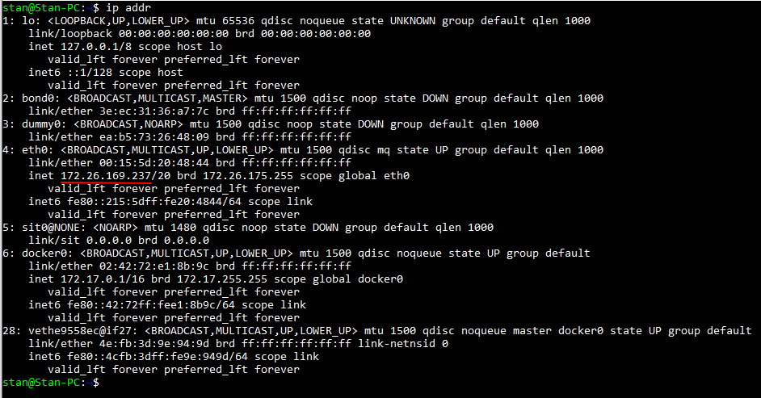

### WSL2笔记

windows推出的wsl的升级版，即WSL2我很喜欢。现在的WSL2是一个真正的Linux，举一个简单的例子，在WSL中，我们是无法执行编译产生的32位.out文件的(似乎是32bit，我记不清了，总之就是某些.out文件)，现在都不再是问题了。

于是，我们拥有了一个真正的Linux，并且使用简单，启动快速，也没有出现显著的资源占用。此外，在WSL2中，可以通过执行`explorer.exe .`来在windows中打开Linux的文件系统，然后就可以直接通过复制粘贴的方式进行文件的访问。

到2019.10.2日，似乎WSL2依旧是体验版，如果想要体验WSL2，必须将系统升级至最新版本，并且加入开发者预览计划，进行快速更新，另外其它的必要设置也要做一些，细节可以网上搜索，其实我也并未理出确定的步骤。但是环境基本设置成功的标志是可以在powershell中执行`wsl -l -v`命令(这只是基本成功)

在参考网上的教程的同时，可以参考一下[微软官方的指南](https://docs.microsoft.com/en-us/windows/wsl/wsl2-index)

### 关于我的一些使用

第一点，这是一个真正的Linux，前面已经说了，所以我可以安装，配置几乎所有在Linux可以做的东西，例如Docker等

第二点，关于文件系统的互相操作，如上所述，直接在WSL2中执行`explorer.exe .`即可在windows的文件管理器中的网络位置打开wsl的文件系统，接下来就可以实现我们想要的任何文件操作了。

第三点，关于二者的进程的互相联系。一种自然而然的想法，我们期望在WSL2中提供一些服务，诸如网络服务，数据库等，那么windows下是否可以访问到这些服务，又如何访问呢？WSL2创建了一个虚拟的局域网，windows系统和WSL2同时处在这个虚拟局域网内，所以我们可以通过IP和端口访问，如何知道WSL2的地址？在WSL2中执行ip addr可以的到如下结果：

划线处即WSL2的ip地址，这个其实我懂得并不多，例如后面那个ip地址是不是windows的？我并不知道，其实稍微测试一下就知道了，但是我现在不想做。

这样，只要在WSL2内部提供了一个网络服务或者数据库服务，就可以通过套接字在windows中访问。这里面的麻烦的地方在于，WSL2每次重新启动，这个ip地址都可能会变，这样似乎有点烦人，但是其实我觉得还是可以接受的。

据网上说，对于较新版本的WSL2，已经提供了更加高级的方法，即WSL2中的端口和windows的端口可以直接复用，例如在WSL2中，在5000端口开了一个python的网络服务，那么在windows的浏览器中，直接访问`127.0.0.1:5000`就可以访问到，经测试确实没有问题。但是现在由于还不完善，所以某些地方还是会有问题，例如经过我的测试，在WSL2中，如果通过Docker开启了一个redis的服务，并且把端口映射到WSL2的6379端口，然后在windows中，通过客户端访问`127.0.0.1`的这个端口是失败的，通过虚拟局域网的IP地址访问是没有问题的。总而言之确实还不算非常完善，但是已经够用，并且一定会越来越好的。

### WorkFlow

现在其实我特别倾向于在WSL2中通过Docker提供各种必要的服务，然后在windows中访问，环境布置很方便，很整洁，用起来也绝对不算麻烦。

windows越来越好用了。