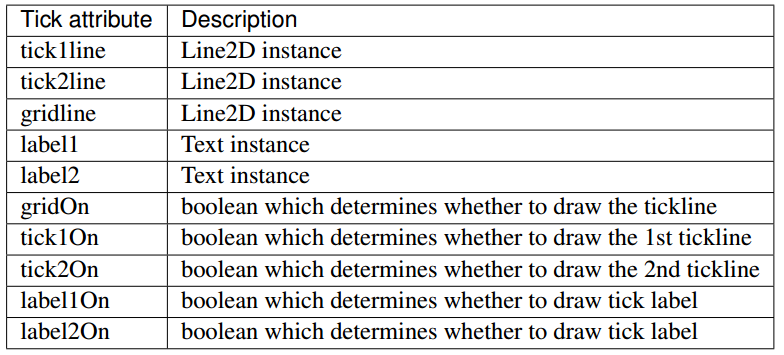

> 大概零零碎碎的记录一些

### 图片尺寸与保存

如何设置图片的大小
此时需要使用figure产生一个图片，然后就能设置大小，figure(figsize=(a,b))

在matplotlib中，如何准确的设置画布的大小，首先先生成figure(figsize=(100,100),dpi=264)

figsize的单位是英寸，dpi即分辨率，也即每英寸像素点的个数，这样在显示的时候大概是绝对准确的

> 华硕R409JF的屏幕尺寸为1366*768，DPI大概是112
> ipad4的屏幕尺寸为2048*1536，DPI为264

但是如果直接保存：svaefig('a.png')，你大概依旧会发现像素不对，这是因为在保存的时候还要再写一下dpi，它并不会自动把显示的dpi调整到与保存时的一致，所以正确的保存写法应该是这样的：savefig('a.png',dpi=264)

### 类别
使用`a.__class__.__name__`可以查看a的类别

乱七八糟做一点记录，目前的知识对于构造树大概是够了的。
我需要了解的是在它的系统里，`Figure`是一个类，这个类的一个实例就是一个`figure`对象，大概相当于一个画板，然后在这个画板上可以创建一个坐标图，就是绘制图像的图。使用`pyplo`t里的`figure()`函数可以创建一个这样的对象。使用最上面的属性设置可以改变整个画板的大小。
然后在画板上可以创建一个坐标系，用术语说就是一个`Axes类`，然后呢，利用pyplot里面的`axes`和`subplot`都可以创建一个`Axes对象`，两者的区别在于前者可以任意改变它在画板中的位置，和大小，比较随意；后者比较规整，整齐，但自由性也比较小，经实验，使用前者也可以在一个画板中创建多个Axes但是由于某些原因，大概效果很不好，所以总结而言，如果你想创建一个可以自由调整大小和位置的***对象在画板中，那么使用前者，如果你想创建多个，那么使用后者。

一段关于基础上用的代码在pythonista里面有简单示例。
总而言之，如果利用上述方法已经创建了一个Figure和Axes对象，那么就可以任意设置相关属性.

ax = Axes
下面就可以使用ax.text，ax.annotate创建文本或者注释,详情参见matplotlib技术手册或者等我继续。

text()可以用于添加文本
一个简化版的text是这样的，text(x,y,str),即只有坐标和字符串
复杂版的里面一个较常用的参数的列表包括：alpha,color,position,rotation,ha,va,size,weight,bbox
只解释其中的几个，ha,va代表对齐属性，相当于设置锚点，但是只能设置，'left','right','center'
size也可以用fontsize
bbox代表一个文本框，bbox是一个字典，一种可行的写法是：
bo = dict(   ),bbox = bo
dict里面的参数常用的包含boxstyle,fc(facecolor),ec(edgecolor),lw(linewidth)
比较简单的就不多解释了，只说明boxstyle,类型包含larrow,rarrow,round,round4,roundtooth,sawtooth,square,每一个都可以设置pad即大小。
一个例子：

	bo = dict(boxstyle='round,pad=0.3',fc='r',ec='b',lw=10)
	text(x,y,str,color='r',rotation=45,ha='center',va='center',size=12,bbox=bo)

特别介绍，关于颜色的问题，fc,ec,color的值：
简化版的是类似于matlab的'r','b'等等
同时也支持#hex格式和rgb,pythonista上面设置比较简单，一个例子：
fc = '#df96ff'
fc = (0.88,0.59,1.0)

这里就是大概的文本的设置，接下来将介绍注释，annotate

关于怎么添加图片在`tree.py`中大概有一个示例

### 关于中文
---
大概，不能显示中文就是因为没有中文字体，下面即修改方法：
1、在`anaconda\Lib\site-packages\matplotlib\mpl-data`文件夹下可以找到一个名为`matplotlibrc`的配置文件，打开，可以找到`font.serif:.....blablabla`这样一行，把注释去掉，同时因为`-`也大概无法正常显示，所以，顺便把下面的`axes.unicode_minus:False`的注释去掉，同时该`False`为·`True`

2、搞一个中文字体的`ttf`文件，例如微软雅黑，然后将其改名为matplotlib里面的字体名，例如`Vera.ttf`，然后将其拷贝到`mpl-data\fonts\ttf`文件夹下，替换即可。

因为pythonista不允许修改内置文件夹，所以这个方法大概无法在上面实现了。

中文依旧十分之诡异，尚未完全解决

一种方式是直接替换文件夹里面的字体,现在感觉这个方式并不好，因为会导致全局字体的改变

另一种方式是：

	matplotlib.rcParams['font.family'] = 'SimHei'

这种方式可以起效，但会修改本程序的全局字体

还有一种方式就是在使用时，修改fontproperties变量：

	plt.xlabel('时间',fontproperties='SimHei')

根据视频上给出的列表，我看到了以下几种字体：

	SimHei
	Kaiti
	LiSu
	FangSong
	YouYuan
	STSong

所以这几种大概都是可以起效的，但是

## 重启版

### 介绍

matplotlib.pyplot赋予其matlab式的工作方式 

### 结构

matplotlib的API分为三个层级，matplotlib.backend_bases.FigureCanvas决定要把图片绘制在哪，matplotlib.backend_bases.Renderer决定如何进行绘制，matplotlib.artist.Artist是使用前二者的用户，或者接口。前面二者是底层的接口，而Artist则负责高等级的构造，95%以上的时间里，我们在使用Artist

Artist也用两种类型，原型和容器，原型负责各种图形元素，例如线，矩形，文本，图像。容器就是放置他们的地方

常见的容器包含了：Figure,Axis,Axes。普通的原型包含了：Line2D,Rectangle,Text,AxesImage等

Figure是绘图得到的图片，Axes则是相当于坐标系那一部分，概念上不太合理，但是，我们可以认为Figure就是画布，Axes就是我们绘制在上的坐标系部分。

典型的应用是：使用plt.figure()创建一个Figure，然后add_subplot增加数个Axes

我们还可以使用Figure.add_axes([x,y,width,height])来指定将axes放在哪，锚点是左下角

然后我们应该使用axes的plot,text,hist,imshow等方法来增加常见的原型。

当我们调用axes.plot的时候就会产生一个图像，然后这是一系列的Line2D对象，他们会存为一个数组--axes.lines，并且二者是直接联系的，你可以对这个数组做增删操作，并会实时反映到图中。

据书上说，每一个Axes容器都包含了两个实例：XAxis和YAxis，他们管理如何绘制刻度，层管理，刻度的标识，以及两个label

### 属性，获取，设置

图上面的每一个元素都由Artist负责呈现，并且都有巨量的属性负责其呈现方式。

figure自身包含了一个Rectangle就是它呈现的矩形区域，我们可以用来设置背景色和透明度

同样的Axes的边界盒子(bounding box)(就是那个有黑色边界的白色盒子)，也有一个Rectangle实例来决定颜色，透明度和其他的属性。

那么Rectangle在哪呢？Figure.patch或者Axes.patch

每一个Artist都包含了一系列的属性：

每一个属性可以使用Artist.get_name()的方法获取，可以使用Artist.set_name的方法设置

为了方便一次设置多个还可以使用Artist.set(alpha=0.2,zorder=2)诸如此类的方式设置

我们也可以使用诸如matplotlib.artist.getp(fig.patch)这样的方法一次性获取某个元素的全部属性。

<u>插播一句，我最近在为生成latex公式然后定位，获取公式的所有尺寸而发愁，如果你拿到ax.text的返回值，然后getp，你会发现有一个属性是window_extent，这个很有可能就是我想要的</u>

### 容器与对象获取

我们已经掌握了属性的获取与设置方法，那么我们应该怎么拿到我们想设置属性的对象呢？Artist分为容器和原型，一般情况下，我们想要设置的对象是原型，对容器的操作一般而言不算太多，当然也还是有的，例如axes的一些属性

这一块主要介绍原型存在容器的哪里，怎么拿到

#### Figure container

顶级的容器是matplotlib.figure.Figure，它容纳了图中的所有元素。

Figure的背景是一个Rectangle，存储于Figure.patch

Figure.axes是一个数组，存储着它里面的所有axes包括了你使用add_axes或者add_subplot等方法加入的，实时更新，呃，不要尝试使用del等方式删除这个数组的元素，没用的，这是内部的一些机制在起作用，我们应该使用添加axes的方式增长数组，使用delaxes()来删除

`fig.delaxes(fig.axes[0])`这样使用

我们可以遍历数组，获取每一个axes

毫无疑问，我们可以直接向fig添加除了axes以外的其他元素，例如文字，线，patches或者图片等

缺省坐标系是像素坐标系，但是这里的像素并不是物理意义上的像素，关于更进一步地介绍，暂时没说，后面会有吗？

更有用的坐标系是直角坐标系，左下是原点，范围是0-1

添加元素进入figure没那么简单：

~~~python
fig = plt.figure()

l1 = matplotlib.lines.Line2D([0,1],[0,1],transform=fig.transFigure,figure=fig)

fig.lines.extend([l1])

fig.canvas.draw()
~~~

这里在线中我们设置了一个transform，就是为了让它知道，前面指定的坐标是figure的直角坐标

总之，figure的属性包含了： 

-   axes,axes的数组
-   patch，背景矩形
-   images，FigureImages patches的列表
-   legends，Figure Legend的列表，和Axes.legends不同
-   lines，Line2D的列表，很少用
-   patches，Fiugure patches的列表，很少用
-   texts，Figure Text的列表

#### Axes container

matplotlib.axes.Axes是matplotlib宇宙的中心，它可以容纳Artist中绝大多数的类，并提供了巨量的方法创造和添加它们

我们也可以对axes进行任何想要的定制，回过头来以Figure为例，他有一个patch，当笛卡尔坐标系的时候是一个矩形，当是极坐标系的时候是一个圆形，patch决定形状，背景，边框，和绘图区域

当你使用ax.plot()绘制的时候，会产生一个Line2D对象，自动加入到axes中，并返回给你，我们可以在plot中设置Line2D的所有属性

但实际上他返回的是一个数组，因为你可以在一个plot里面绘制多条线，所以我们会使用解包技术，取到第一个`line, = ax.plot(....)`

所有的line存在axes.lines中

类似的是创建patches的各种方法，例如bar()或者hist()等，也会返回对应的patch，并且存入到axes.patches中

一般情况下，除非我们有很强的目的性，否则不要直接向axes.lines或patches中添加元素，因为在系统自动添加的时候，系统会着很多的工作，例如改变数据结构，调整结构，等等很多很复杂。

但是，如果你真的非要自己动手，那么还是提供了axes.add_line()和axes.add_patch()的

~~~python
rect = matplotlib.patches.Rectangle([0.1,0.1],width=5,height=12)
ax.add_patch(rect)
ax.figure.canvas.draw()

~~~

就这样用，但是注意一下第一个列表指定了左下角的坐标，写错了显示超出范围是看不到的哟

虽然书上说要调用draw来强制要求显示，但是测试中发现只需要add就会显示

Axes提供了很多诸如plot这样的系统方法来帮助我们创建各种原型，并加入到axes的某个列表或称为容器中：

在axes的所有元素中，有两个最特别，是两个容器：XAxis，YAxis

他们负责标度和标签，存储于axes.xaxis和yaxis中

axes提供了很多处理他们的方法，让你在手工处理之外有了更方便强大的选择

下面是axes的属性集合：

#### Axis container

matplotlib.axis.Axis处理刻度线，刻度标识，网格线，label等

axis也会存储数据，处理定位，缩放等，其中Locator会处理将刻度放哪，Formatter处理怎么呈现字符串

每一个Axis都包含一个label属性，是主次刻度的列表，刻度是XTick和YTick实例，他们包含的实际上是线和字符串，用于渲染成刻度线和刻度的labels，因为刻度是动态的，所以我们应该使用get_major_ticks()和get_minor_ticks()来获取主次刻度

另外还有各种方法来获取刻度，刻度位置，刻度的lable以及刻度的刻度线

关于主次刻度呢，我还没见过什么叫次刻度，我们默认拿到的就是主刻度线，哦哦哦，应该指的是小的刻度线吧，没有数字label的那种

~~~python
axis = ax.xaxis
axis.get_ticklocs()
axis.get_ticklabels()
axis.get_ticklines()
axis.get_ticklines(minor=True)
~~~

下面是一个获取方法的集合：

我们可以借由这些手段任意设置刻度线和刻度label

~~~python
fig = plt.figure()
rect = fig.patch
rect.set(fc=(0.1,0.2,0.3))

ax = fig.add_axes([0.2,0.2,0.6,0.6])
rect2 = ax.patch
rect2.set(fc=(1.0,0.8,0.8))

for label in ax.xaxis.get_ticklabels() :
  label.set(color='red',rotation=45,fontsize=16)
  
for line in ax.yaxis.get_ticklines() :
  line.set(color='green',markersize=25,markeredgewidth=3)
  
plt.show()
~~~

#### Tick containers

matplotlib.axis.Tick是最后一个容器

它包含刻度和网格线

每一个都可以通过属性直接拿到，或者设置：

这里注意一下最后四个，对于yaxis他的刻度线和label都是分左右的，左边是1，右边是2，我们可以设置最后四个的布尔值，来控制显示情况，对于xaxis来说下是1上是2

我们可以拿到label，这是一个Text，于是我们就可以调用他的方法来设置文本的颜色等

另外在matplotlib.ticker中，我们可以产生一个特定的刻度label的格式，然后传给x或y从而实现定制化：

~~~python
formatter = matplotlib.ticker.FormatStrFormatter('$%1.2f')
ax.yaxis.set_major_formatter(formatter)
~~~

容器到此结束

### 图例

图例之后就是高级操作了，之前的是中级操作

一个图例严格而言需要一个handler从而知道自己是谁的图例，然后还需要label作为标记文字，而不是像我们平常所用的那样，直接写legend('first line')这样，handler就是一个原型，Line2D,patch等诸如此类的，如果恰好这个原型自带了label属性，那么我们甚至不需要在legend中写字符串，它会自动提取label，那么我们必须要求这个handler是图中的元素吗，换句话说，只有图中有元素的时候才能写图例吗？并不是，无论何种手段，我们只要提供一个原型作为handler即可，我们可以自己创建一个，然后不把它添加到图中，例如：

~~~python
line = matplotlib.lines.Line2D([],[],color='blue',marker='*',markersize=15,label='blue star')
plt.legend(handlers=[line])
plt.show()
~~~

当然我们也可以传给legend第二个参数，作为文字

#### 定位

哇，竟然就这样结束了，完全没有说什么，完全没有解释。看不懂

定位的时候用了参数bbox_to_anchor=()，却完全没有解释元组里面每一个参数的意思，还有loc，ncol，mode，borderaxespad都没解释

接下来说可以有多个图例

然后说，我们可以自定义handlers，只要定义两个类，第一个随便，可以是空的，第二个是第一个的handler，第二个需要实现一个legend_artist的方法，接受一系列的参数，返回一个特定的值就可以，然后在legend里面传给handler_map一个字典，字典的键是第一个类，值是第二个类的实例

很懵，然后就没了

### 高级教程

#### Transformations Tutorial

you know what? I want take a break

