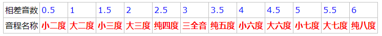

## 乐理基础

### 基础知识与定义

音 ： 称一个特定频率的声波为一个音

纯音： 一个特定频率的简谐振动产生的声波为纯音

复合音： 多个纯音组合得到纯音

音乐： 大量复合音组合得到音乐

纯音组合成复合音的方式多种多样，最常见的两种是：谐波叠加，拍音叠加

#### 谐波叠加

将一个特定频率f的正弦波称为基波，频率为其整数倍的正弦波称为谐波，音乐上也称之为泛音。

如：称f为基波，则可称2f为二次谐波，诸如此类

基波与谐波叠加，得到的复合音的方式称为谐波叠加，明显谐波叠加得到的波的频率等于基波频率

单个乐器演奏单个音，得到的就是一种谐波叠加音，称之单音，单音的频率f称为高音，一般而言，传统乐器得到的声音都是复合音，这种复合音的基波一般振幅最大，谐波振幅较小

不同的乐器即使演奏同样的高音，听起来也不一样，称之音色不同，这是因为谐波叠加的时候，振幅的比值不同

#### 拍音叠加

拍音叠加在谐波叠加的基础上产生，谐波叠加得到一个单音，不同频率的单音叠加，同时如果各单音的振幅接近，称之拍音

因而，拍音叠加的情况是相当复杂的，甚至不一定会得到一个音（不存在周期性），但是有一些特殊情况，例如：

1. 如果两个单音的频率均为整数，则叠加得到的拍音的周期等于二者周期的最小公倍数
2. 如果两个频率相差一倍的单音进行叠加，就会得到频率等于低音频率的拍音，这样的拍音听起来很像是单音

纯八度：两个频率相差一倍的单音（也即频率比为1：2）之间的音程称为纯八度

音程：两个音之间的频率差称为音程

### 相对高音与十二平均律

如果将一个纯八度按照一定的规律分为12份，每一份称为1个半音，两份称为1个全音，这种称之为十二平均律

十二平均律划分十二份的规律为指数曲线，相邻单音之间为等比例的，比值为 $\sqrt{2}$ 

因此十二平均律在一个纯八度中分出了13个单音，规定相邻两个音之间的音数为0.5（虽然一个频率就是一个音，原则上应该是无穷）

毫无疑问，给定音程和较低的音频率，我们就可以计算较高音的频率。对于十二平均律来说十三个单音之间的音程只有12种，他们对应的之间的音数为从0.5到6，规定这十二种音程的名字：

### 绝对高音与五线谱

### 钢琴键盘

钢琴有52个白键, 36个黑键, 共88键.

白键和黑键的排列为每七个白键为一组, 其中左侧的三个键两两之间有一个黑键,共两个,右侧四个白键两两之前一共3个黑键,所以一组一共七个白键,五个黑键,一共12个键.

整个键盘最左侧有两个白键加一个黑键, 最右侧一个单独的白键. 中间有7个完整的组. 所以一共是3+7*12+1=88个键.

每一组的七个白键自左至右都叫做CDEFGAB, 这七个组再加上左右的两个不完整的组,一共九个组.

这九个组分别叫做

~~~
大字二组, 大字一组, 大字组, 小字组, 小字一组, 小字二组, 小字三组, 小字四组, 小字五组.
~~~

所以大字二组和小字五组是不完整的组.

大字组是低音区, 小字组到小字二组是中音区, 小字三组到小字五组是高音区. 所以每个区3个组, 但是低音和高音区都比中音区键少.