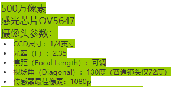

## 树莓派视频串流

欧科，所以这里的目的基本就是借助树莓派实现实时视频监控。

至于工具的话，我知道有一些现成的工具，傻瓜式的操作那种，也许工作状况也更好，但是我不想要这种。所以，我的工具流是利用picamera模块捕捉画面，利用flask完成串流的传输，前两天我也买了一个极简版的云台骨架，所以我也会尝试在web端同时增加用户登录和舵机控制功能。

当然，我对串流技术几乎一无所知，这里我的参考资料和所有的代码都是在[这位作者]( https://blog.miguelgrinberg.com/post/video-streaming-with-flask )的博客和[github代码]( https://github.com/miguelgrinberg/flask-video-streaming )基础上修改的，在这里表达感谢。

其实至少一年半之前，甚至将近两年之前，我已经尝试过一次，但是当时我还是个智障(现在也差不多)，并不是非常理解，也没有能力做太多的好的修改，测试是成功的，但是我没留下几乎任何代码和文档，所以现在再试一次。反正现在也不想学习，心情也蛮糟糕的，那就干脆找点事情来做好了。

在第一部分我会尝试翻译picamera文档的部分内容，之后也会尝试说明一些硬件问题，以及GPIO舵机控制，之后说明Flask构建整个在线网站的基础架构。

### Picamera

如何安装库以及如何设置安装摄像头的硬件部分就不再描述了。

~~~python
from time import sleep
from picamera import PiCamera

camera = PiCamera()
camera.resolution = (1024, 768)
camera.start_preview()

sleep(2)  # 相机预热
camera.capture("foo.jpg")
~~~

此外可以把camera获取到的数据输送进入各种stream中， 如file object BytesIO， socket等等。

`camera.capture("foo.jpg", resize=(320, 240))`可以将获取到的内容resize，这个过程将在GPU执行， 因此高效得多。

获取连续内容

捕捉连续画面的时候， 需要注意很多事情， 例如曝光时间，白平衡，画面增益等等。

曝光时间： `shutter_speed`

`iso`

曝光增益： `analog_gain`和`digital_gain`， 设置`exposure_mode` to off

白平衡： `awb_mode` to off ， 设置`awb_gains`

这些数值的设置很难，对于`iso`，一般而言，白天是`100~200`，暗光下`400~800`， 可以查询`exposure_speed`来设置`shutter_speed`， 。。。。。看文档吧

一个上述设置的简单例子：

~~~python
from time import sleep
from picamera import PiCamera

camera = PiCamera(resolution=(1280, 720), framerate=30)
camera.iso = 100
sleep(2)

camera.shutter_speed = camera.exposure_speed
camera.exposure_mode = "off"
g = camera.awb_gains
camera.awb_mode = "off"
camera.awb_gains = g

camera.capture_sequence(["image%02d.jpg"%i for i in range(10)])
~~~

延时拍摄序列

`capture_continuous()`， 此时相机会持续获取画面，直至让他停止。图片会自动赋予名字，可以方便的控制画面之间的间隔。

~~~python
import time
import picamera

with picamera.PiCamera() as camera:
    camera.start_preview()
    time.sleep(2)
    for filename in camera.capture_continuous('img{counter:03d}.jpg'):
        print('Captured %s' % filename)
        time.sleep(300)
~~~

也可以在特定时间自动拍照，参见文档

低光拍摄要设置高增益和长曝光

输出至网络串流

这里文档上给出了一个使用自定义极简协议的socket串流

视频录制

到文件

到流

到多部份文件

到环形缓冲流

到网络串流，这里给出了一个基于socket的视频串流代码，但是和之前文件一样不是基于HTTP协议的，只是简单地把数据发送过来到播放器而已

另外支持叠加功能，支持在获取的内容上面覆盖图片或者文字。

可以控制相机上的LED的开关

这里记录一下我买的相机的参数，商品已经被下架了，得记录一下：

网上说500万像素的话，分辨率是2560*1920

大概设置了一下，代码也随便写了写，东拼西凑一点，现在整个系统可以工作了，但是我已经没什么太多的兴趣了。这里只是简单的记录一下先。

### 硬件问题

关于如何组装相机和二自由度的云台就不说了。现在的这个云台是通过两个舵机实现两个自由度的调节的，即Pitch和yaw。

两个多级都是类似于SG90那样的微型舵机，方位角是不足180度的，大概也就140度左右。然后yaw的自由度又因为云台硬件的问题大概70度左右？似乎吧。

然后，硬件上最大的问题是舵机供电问题，舵机在运行的时候电流消耗较大，几乎所有的资料都不建议直接使用5V的GPIO供电，烧毁树莓派的概率很大。所以供电成了一个麻烦问题。同时因为放在学校的只有我的电子设备和元器件中的非常非常小的一部分，我只能拿出不到十根杜邦线，一个组装好的220V交流转12V直流，再经LM98转5V的电路板，但是这块板子少了很多东西，例如杜邦线不够，最严重的问题是没有插头.......巨尴尬。

网购电池盒和电池，甚至使用Arduino供电的方式我都想了，但是都不满意。

最终我想到了一个解决之道。可以使用树莓派的USB供电，USB2.0据说可以供电500mA，足够了。于是我就搞到了两根USB线，然后配合杜邦线和胶带，从USB取到了电。当然要注意识别一下USB中的电源线，应该还算可以识别的吧。

总之硬件到此完成。

### 软件架构

然后直接在一开始提到的作者提供的Github代码的基础上修改，修改的地方暂时也就只是修改了JPEG的尺寸，做了一下resize，期待可以降低一点网络延迟。

然后增加了一个云台控制工具，也就是四个按钮，点击时会以Ajax的方式向服务器提交舵机角度控制请求。

然后，舵机的控制直接是从网上找了一份PWM的代码，然后随便做了个很垃圾的包装，做成了一个类，然后就可以在flask里面进行舵机控制了。

现在为止没有做任何后台管理功能，然后页面也没有做任何的必要美化，只是简单的实现了控制，另外，我也没有再认真研究一下PWM，我严重怀疑这一份PWM代码是不是完美，因为工作起来颤抖很多。此外，还必须做一下用户登录，认证，cookie等功能，不然暴露太危险。

代码的话，现在的代码在raspberry_file仓库的camera文件夹中保存了一份。什么时候做修改的话都会及时同步过去的，等到最终定稿的话可能会换个位置存储。

### PWM控制代码

舵机的位置由脉冲的长度控制，舵机期待每20ms接收一个脉冲，