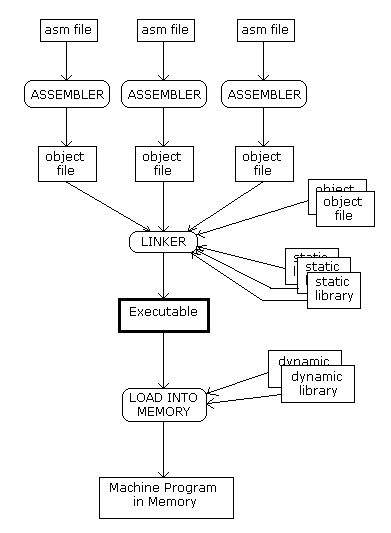
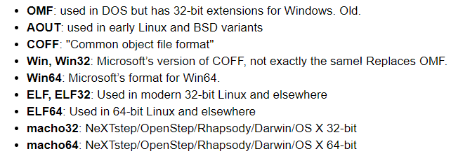

## 汇编语言

呃，我想写OS，如果要从boot loader开始的话，那么似乎就必须要使用汇编语言。我如果不了解这种东西的话，又不愿意动手，所以，我决定看看汇编，反正又不赶时间。

其实我现在依旧对整个体系不了解，我知道的大概是这样的，首先汇编是针对特定平台的，例如我现在的目标就是x86平台的。然后呢，还涉及到了语法问题，Intel语法和AT&T语法是不一样的，我觉得前者更加顺眼。再后就是编译与编译器问题了，据我所知现在有MASM，NASM，GAS，第一个是微软的汇编器，第二个是另一个很有名的汇编器，他的文件后缀似乎一般是`.asm`，第三个是GNU的汇编器，使用的是`as`命令，后缀似乎一般是`.s`，据别人说NASM使用Intel语法，GAS使用AT&T语法，但是又说现在GAS也支持Intel语法了，还说其实NASM的语法也并不是标准的Intel语法，而是自己改造过的。

在这里，我选择NASM，平台是windows，链接器是GNU的gcc，也许其实是ld。

参考书是[汇编语言 第三版--王爽](https://book.douban.com/subject/25726019/)

以及[x86汇编语言:从实模式到保护模式](https://book.douban.com/subject/20492528/)

还有pcasm book

另外也参考了NASM的手册，以及从stackoverflow等处获得了很多帮助


下面的笔记跨越了相当长的时间，参考了非常多的资料，所以原本写的十分之凌乱，并没有非常详细的脉络，我已经组织调整过了一次，但是应该依旧存在着不少前后顺序的问题。


### 预备

首先科普一下CPU的型号，Intel最初推出了4004处理器，之后是8008，再接下来就是8086，之后推出80186，80286，80386等一系列处理器，他们的共同特点是使用相同的指令集，向下兼容，人称x86。最早期是16位的，然后的86处理器都是32位的，之后AMD率先推出x86架构下的64位，之后称之x86-64，i386指的其实是80836处理器，也代指32位。

最早期的处理器实际是16位的，之后是32位，又称IA-32，但是我们现在使用的64位由于不是创始自英特尔，所以并不是IA-64，实际上IA-64是存在的，是intel开发的，但是与x86完全不兼容，似乎见的也不多

自然，汇编代码对于不同的指令集，32位或者64位的CPU都是很有针对性地。这点很重要。

X86起源自8086处理器，这是一款16位处理器

其中的通用寄存器有8个，各16位，分别是AX,BX,CX,DX,SI,DI,BP,SP

其中的ax,bx,cx,dx都可以拆分为高八位和第八位，命名诸如AH,AL

后四个不能分解，SI,DI常用语指针，BP和SP用于堆栈


### 基础

下面的这一大部分内容非常杂，主要来自于第二本参考书，无论是学习汇编还是试图写一个极简的OS都很重要。

处理器中的指令是集中在一块连续的内存中的，形成一个代码段，数据也集中在一块，形成了数据段

因为常见的复杂情况下，我们不能指望决定数据和指令的绝对地址，所以相对地址的存在很必要，方法就是将内存划分为段，段内部使用偏移地址。在硬件上对这种机制也是支持的，对应的就是代码段地址寄存器CS，数据段寄存器DS

CS决定了指令从哪个段开始执行，DS则决定了数据的位置

于是指令中指定的内存地址就会作为段内偏移地址

8086的段寄存器有4个，分别是CS,DS,ES,SS,前两者已经知道了，ES是附加段寄存器，作用就是当需要两个数据段的时候和DS一起工作，使用一个时，我们可以指定使用哪一个，默认是DS。SS是栈段寄存器

IP是指令指针寄存器，和CS合作，IP只受处理器控制，CS指向指令的段地址，IP指向偏移，处理器会自动根据指令的长度修改IP的数值

因为寄存器都是16位，采用的又是段地址加偏移地址，所以地址也只有16位而已。但是8086实际有20根地址线。

所以实际上的寻址策略是段地址左移四位，再加上偏移，共20位，寻址空间1MB，段地址寄存器16位，所以最多也不过16位个段，所以每个段应该是16字节，所以段内偏移量只需要4bit就可以表示。当然段长并不是固定的，在8086里面并未作出限制，但是明显段最长只能是16位，64KB。

然后，要求的是偏移必须从0000H开始，所以段地址必须能被16整除，所以不是任何地址都可以作为段地址，我们可以根据实际情况决定我们的段从能个地址开始，然后决定我们的段的长度，只要不超过64KB

这样的话实际上8086的内存访问很随意，一个物理位置可以对应多个逻辑地址

之前已经知道了，实际上外围的设备也是被映射到了内存空间中进行操作的，换句话说8086的20位也就是1MB的寻址空间并不都用来访问真正的内存DRAM，有一些划分出来用于其他设备，这些空间的划分大概是00000H到9FFFFH用于DRAM，剩下的F0000H到FFFFFH用于ROM，中间的用于外围设备。

对于8086来说，当复位的时候，CS会被设置为FFFFH,ip设置为0000H，于是cs左移4位，相加形成了ffff0h这个地址，这里距离内存末端只有16字节，在ROM中，这里一般会被放置一条jump指令，跳转到ROm的低位，开始执行。

这块ROM芯片内存有限，会执行很多重要的自检等功能，也包含了一些输入输出，他又称BIOS，当BIOS完成使命之后，就会把控制权交给辅助存储设备。


然后说硬盘，机械硬盘由多个上下重叠的盘片组成，每个盘片两面，都可以存数据，每个面都配备一个磁头读写，因为所有的盘片是同时转动的所以数据并不是逐面连续存储的，而是将每一面划分扇区，不同片的不同面的同一个扇区组成一块连续空间，扇区的划分数目并不一定相同，但一般是63个。扇区编号从1开始，盘片的不同同心圆组成不同的磁道，每个磁道进行扇区划分。面编号和磁道编号从0开始，面有时也用磁头来称呼叫头，磁道有时也叫柱面。

内存明显是易失存储，所以内存是不会存储持久数据的，属于一个流动站。那么电脑里面能存储持久数据的自然只有ROM-BIOS和外部的硬盘等，BIOS负责开机自检等引导功能，完成之后他做的工作就是就是从硬盘拿到数据交给内存然后执行，所以，自然很明显的操作系统是在硬盘上。

BIOS对硬盘开始干的第一件事就是，读取0头0柱面1扇区的数据，导入内存，放在cs=0000H，IP=7c00H位置，这个位置的决定来自最初的设计者。我们称这个扇区叫做叫做主引导扇区，它的功能就是继续读硬盘，继续执行，操作系统就是这样逐步启动自己的。

所以，明显我们可以自己修改主引导扇区，让电脑做我们想让他做的事情，很合理，装系统就是这么干的，烧录U盘，做的就是从主引导扇区开始写。但是我们明显不能在我们的电脑上做，那样会直接覆盖我们的硬盘，原来的操作系统就完蛋了，但是当然可以写U盘了，这没问题。

硬盘的磁头，柱面，扇区访问方式称作CHS，这种方式要考虑很多，范围之类的，不方便，现在通用的是LBA，逻辑块地址，硬盘硬件上会自动把按照数字顺序的LBA地址转换为CHS地址，当然这个块的单位还是扇区。

在某些，也许很多地方，一个扇区的大小都是512字节


假如我们想自己写一个极简版的OS，那么明显我们应该从主引导扇区开始，为了反馈，我们需要做显示，那么也就意味着我们要控制显卡。

显卡是这样工作的，用户操作的是显存，考虑最最简单的情况，可以用显存里面的每一位控制一个像素的亮暗，当然要是真彩色的话，每个像素就需要更多的位来控制，所以显存的大小决定了显示的能力。明显通过手动控制逐个像素的方式来显示太过于复杂，要做极其复杂的计算。所以显卡做了改进，例如在文字模式下，屏幕只能显示文字，这个时候屏幕会被划分为小块，每个块可以显示一个字符，当我们想显示字符的时候，只需要调用这个字符的编码，例如ASCII编码，显卡的字符发生器会自动把它转换为特定像素的明暗，显示。当然显卡还有图形模式，那就会更复杂了。现在的显卡都支持文字模式和图形模式。书上说，电脑在自检完成后显卡的初始显示模式都是文字模式，并且是80*25的文字模式，每行80个字符，共25行

8086的内存空间中0xb8000到0xbffff这段空间就是给显存的

所以显存的段地址启示自首地址左移四位，b800H。所以首先我们必须将数据段寄存器设置为B800H，如上所述可以使用DS或者ES，如`mov es, 0xb800`这里唯一的问题是，Intel不允许这样，访问段寄存器不能使用立即数，只能用通用寄存器。

在显存中每个字符使用两个字节，第一个字节是字符的ASCII码，第二字节是显示属性，其中高4位是背景色，低4位是前景色，具体的排布是这样的`KRGBIRGB`，其中背景色的最高K位代表了闪烁与否，RGB自然代表了三原色，混合可以产生八种颜色，背景色的I位代表亮度，1是高亮，0是正常。举个栗子：

`0x48 0x07`这两个字节其中`0x48`代表了字符`H`，后面的`0000 0111b`代表了不闪烁黑底白字不高亮

已经设置过了ES指向显存了，那么下一步只需要将要显示的内容写入ES指示的内存位置即可。

`mov byte [es:0x00], 'L'`这条指令里面需要解释的是，第一，byte指示了我们的内容是一个字节，因为也可能是一个字，如果是一个字就要用word指示。当然如果后面是已知大小的寄存器就不需要修饰了。第二`[es:0x00]`这代表了段地址加偏移地址指定的内存，当然可以只写偏移地址，那么默认的段地址就在DS中了。第三：`L`这代表的是L这个字符的ASCII，当然也可以直接写ASCII，不过比较麻烦不是吗。

然后就是挨着把显示模式和其他字符填进去了。

当然mov的其他用法注意还有很多，暂不说明


### NASM

选择NASM汇编器，那么需要知道的东西首先必须是开发过程，源文件怎么才能运行？源代码是.asm的汇编文件，汇编器的作用应该是把它变成二进制，这个过程就是NASM在完成，然后二进制文件并不能直接运行，至少在普通情况下不行，然后还需要进行链接.

我觉得写汇编首先必须要知道代码应该是如何组织的，或者说源代码应该怎么写，这里面挺重要的就是代码运行的入口点，输入输出，尤其是输出，至于其它的代码的书写也很重要，但是可以稍微往后放一下。再然后，最重要的是代码如何运行。

我之前已经很清楚了，汇编代码的运行大概有这么两种方式，第一种，不依赖与操作系统，这种常见的套路是搞一个虚拟机，然后在没有操作系统的情况下，直接从BIOS开始搞定，这其实就有点类似于为自制OS打下基础了。但是，说实话我短期内想要的并不是这样的方式。如果希望使用这种方式，那么推荐参考书：`X86汇编：从实模式到保护模式`

第二种方式，在特定操作系统下进行，前一种方式只需要将汇编源码编译，写入磁盘即可。这种方式要多出一步链接，我的理解是，因为有操作系统的存在，那么源码如何放入内存，相对寻址，执行完毕如何将控制权交还操作系统都需要考虑，所以链接是必须的。

问题就出在这里，前面说了汇编器我选择NASM，连接器其实有很多选择，问题在于各不相同，并且每一个选择我都不太懂到底怎么回事。我成功使用GOLink链接成功过，但是要使用一些奇奇怪怪的kernerl32.dll等动态链接库，我搞不懂。我倾向于使用GNU的连接器。

假设我们已经安装完成了NASM，并且有了一个简单的样例，那么接下来就是编译:

`nasm -f win32 first.asm`

运行上述命令，即可完成编译，一般生成obj文件。当然也可以通过`-o`指定输出文件的名字，网上有人会奇奇怪怪的指定各种后缀的输出文件。例如有的人编译完的文件是`.o或.obj`，也有`.bin`和`.com`的，那么这个到底是为什么，会不会有什么特别的考虑？结果是后缀是无所谓的，无论是哪一种，内容都是完全一致的。要真正实现不同的输出，应该在`-f`中指定了特殊的格式。由于我们使用的是win平台，并且开始一般都是32位的汇编，所以绝大多数时候使用的都是`win32`格式。至于其他更多格式的相关信息，应该去参考一下NASM的手册。

同时，我们可以产生一个二进制与源码的对比文件，使用命令`nasm -f win32 first.asm -l first.lst`即可

当编译完成之后，下一步就是如何链接生成可执行文件。

根据网上提供的资料，我们选择`gcc`，但是这里要注意，因为编译时选择了32位的模式，那么链接器也必须是32位的，所以，需要一个32位的mingw。

我在stackoverflow上面，以及一个叫做`pcasm-book`的书上面找到了使用`gcc`的例子，但是失败了，根据错误信息，我明白问题应该是出在gcc是64位的上面，之前因为OpenGL的编译，我特意下载了64位的mingw，网上说某些情况下在gcc命令中加入`-m32`参数就可以实现32位的模式，但是我用的这个版本并不行，没办法，只能重新下载32位的mingw，加入path，以后需要的话再改回64位(我希望可以找到一个二者并存的方法，但是，怎么找呢？毫无头绪)

然后执行下述命令：`gcc -o first.exe first.obj`即可

#### 第一个样例

要写出第一个样例，要解决的最大的问题就是IO，尤其是输出，没有输出就无法知道程序的执行情况。

输入输出很重要，尤其是输出。

但是输入输出是一个严重依赖于系统的事情，高级的语言提供了统一的标准接口，但是汇编不提供，用户必须直接和硬件打交道。如果代码不在操作系统内执行，我们就可以直接控制显卡，但是对于我们现在选择的方式，这样不行。

汇编常常和C交互，因此可以考虑使用C的标准。

现在的问题就回到了代码组织上。前面提到过，输入输出似乎是一个很重要的问题。现在就面临两个选择，如果选择资料十分完善的pcasm book，那么它的输入输出采用了书的作者自己写的一个`asm_io.asm`扩展文件，这相当于又来了一个黑箱，也不知道后面会不会解释原理。如果选用stackoverflow上面的简单方法，用起来的确会简单很多，也没有额外的扩展文件，但问题是也没有后续的参考资料，不知道走不走得下去。

现在，暂时先把这两种方法都记录下来：

`pcasm-book`

使用了一个`driver.c`文件，作为辅助。另外需要`asm_io.asm`和`asm_io.inc`文件，这两者可以从pcasm的github获得，然后就是源文件`first.asm`，这个源代码一开始就搞得比较大而全，但无所谓了。

driver.c

```c
int main()
{
	int ret_status;
	ret_status = asm_main();
	return ret_status;
}
```

first.asm

```assembly
%include "asm_io.inc"

segment .data

prompt1 db "Enter a number : ", 0
prompt2 db "Enter another number : ", 0
outmsg1 db "You entered ", 0
outmsg2 db " and ", 0
outmsg3 db ", the sum of these is ", 0

segment .bss

input1 resd 1
input2 resd 1

segment .text
	global _asm_main
_asm_main:
	enter 0,0
	pusha

	mov eax, prompt1
	call print_string

	call read_int
	mov [input1], eax

	mov eax, prompt2
	call print_string

	call read_int
	mov [input2], eax

	mov eax, [input1]
	add eax, [input2]
	mov ebx, eax

	dump_regs 1
	dump_mem 2, outmsg1, 1

	mov eax, outmsg1
	call print_string
	mov eax, [input1]
	call print_int
	mov eax, outmsg2
	call print_string
	mov eax, [input2]
	call print_int
	mov eax, outmsg3
	call print_string
	mov eax, ebx
	call print_int
	call print_nl

	popa
	mov eax, 0
	leave
	ret
```

编译与运行

```makefile
nasm -f win32 first.asm
nasm -f win32 asm_io.asm
gcc -m32 -o first driver.c first.obj asm_io.obj
.\first.exe
```

注意这里的gcc必须是32位的，我还是加了`-m32`，也许不加也可以


下面是来自[stackoverflow](https://stackoverflow.com/questions/37407363/create-an-exe-file-in-assembly-with-nasm-on-32-bit-windows)的简单版：

main.asm

```assembly
extern _printf
global _main

section .data
msg: db "Hello, world!",10,0

section .text
_main:
    push msg
    call _printf
    add esp,4   
    ret
```

编译与运行

```makefile
nasm -f win32 main.asm
gcc -m32 main.obj -o main.exe
.\main.exe
```

注意，这一切都是在windows操作系统下执行的，文件也都适用于windows，应该是不适用Linux

另外运行最后的可执行文件的时候，如果直接双击exe的话，窗口执行完毕就快速关闭了，可能导致来不及看清输出，所以建议在powershell下面调用exe来执行，这样就不会有问题了，就像上面一样


基本上到现在为止，我们已经可以运行起来第一个例子了，下面的目的就是补充汇编基础知识和搞清楚所有上述代码。


### 代码的组织

如何组织一个汇编文件，首先最重要的是，入口点。然后是代码的结构。

实际上入口点也并非有绝对统一的标准，有时有些约定，有的时候则是可以手工指定。

对于前面的两个样例，来自pcasm的例子，明显是借助了c语言来运行，所以它实际上提供了一个标识符，然后被c以函数的形式调用了。

对于比较简单的那个，它采用的入口点是链接器ld约定的`main`，我们要定义一个`main`标识符，并把它设置为`global`，链接器就会自动识别。

此时要说一点与此相关的，首先是`extern和global`两个指令，其中前者意思是导入来自外部的东西，后者是将内部的东西标记为外部可见的。这是NASM的特性

然后，特别的，我们可以从例子里面看到它导入了`_printf`，并导出了`_main`，这两个实际上对应的是来自c语言的`printf`和`main`，但是windows平台的特别要求是导入还是导出都要加下划线前缀，`Linux`平台就不需要。当然windows有些时候也不用，可以试一下，不行的话去掉再试试就行。

ok，入口点的问题结束之后，接下来就是代码的组织形式。实际上，最简单的程序可以直接写指令，然后编译器会直接把整个代码识别为一个段，这里的段就是前面提到的最大是64KB的段，所以，问题就是这样不够条理化，然后也有最大的大小限制。

所以，规范的，我们应该使用多段的结构。

#### 段

我们写的代码自然都是指令，那么编译器会把整个程序作为一个独立的段，编译器编译完成之后会赋予每个指令一个地址，这个地址叫做汇编地址，从0开始，当程序被加载到内存之后，这个地址实际上就成了偏移地址，这整个代码存在于一个段内。

当我们的程序更加复杂的时候，我们可以将程序划分为段，而不是像之前那样，整个程序都是一个段，因为16位下，一个段最长只有64KB。

例如程序应该划分为规范的代码段，数据段，附加段，栈段等。

当我们划分为段之后，你就可以在编译完成的文件中看到多个偏移地址从0开始了，当然这是应该看lst文件才能看到。

在NASM中段使用汇编指令section或者segment来定义。格式为：

```assembly
section name

segment name
```

对编译器来说，它并不知道段的意义，所以段的用途是程序员确定的。一个段的开始自定义后面开始，直至下一个段定义为止

自然如果没有段定义，整体就是一个段

段可以指定对齐方式，就是该段最小长度，可以指定16或者32字节，用align指定，如：

`segment code align=16`，这种情况下，当段内不够长度时，就会自动填充空白字节

段还有更多东西，等待补充，可以直接看上述参考资料，基本上都有参考价值。


这时我们知道了每一行都有自己的标号，就是自己的偏移地址，其实也代表了内存中偏移地址对应的指令，在代码中我们就可以使用标号：

~~~assembly
infi: jmp near infi

infi jmp near infi

infi:
	jmp near infi
~~~

上面三种写法都是一样的，infi就是这个jmp指令的标号，可以选择带不带冒号都行，换行也行，因为如果换行的话这一行就没东西了，那么infi自然就对应了下一行。这就是标号背后的原理。当我们后面需要引用这条汇编指令的地址的时候，我们就可以使用标号，如果不需要，自然不用写标号

标号的命名要宽泛得多，可以包含字母数字下划线，`$,#,@,~,.,?`但是开头只能是字母，点号，下划线，问号

说得有点晚，但是还是说一下指令的完整结构：

`标号： 指令 操作数  ;注释`

当然，这些结构并不是完全都必须的。

重要的是，标号只是接下来这条指令的地址，与后续代码其实并没有明显关系。只是代码是顺序运行的，所以它会从标号开始顺序往后执行，所以。。。

在NASM里面有一些约定俗成的特殊段，例如`section .data`是数据段等，看资料吧，没必要再全部摘抄了。


下面继续进入随意模式。。。。。有些资料里面就能学到的知识就不再赘述了，只记录一些那基本资料里面找不到的。


上述大部分知识都是针对8086来说的，在8086中寄存器是16位的，这时的一个字被定义为两个字节。地址线20根，采用段地址左移加偏移的方式来寻址，这样寻址空间被限制在了1M，而程序也必须在超过64KB时分段，而同一个物理地址有多个逻辑地址。这种寻址方式后来被称为实模式。

当处理器发展至80386，这是一款32位处理器，寄存器被扩展至32位，原本的各种AX,BX等都变成了EAX,EBX等，区别在于高两字节没有直接访问方法，低两字节就是AX，同样具有AH,AL

各种寄存器都被扩展了，除了段寄存器，段寄存器依旧是16位，并额外新增了两个类似于ES的附加段寄存器FS,GS，自然也是16位。这时字的概念依旧被保持成了16位，虽然怪怪的

从80286开始诞生了保护模式，虽然80286依旧是16位的。

保护模式下，采用了虚拟内存技术。80286是16位的，所以即使采用了虚拟内存技术，段的最大长度依旧是64KB

80386开始进入32位保护模式时代，偏移地址32位，段空间达到了4GB。段开始继续划分为4KB的单元，称之内存页，从此时开始，段不必再整体存在于内存中

~~~assembly
mov dest, src  ;移动src的数据到dest，两者长度需要一致，后者可以是合适大小的立即数
add a, b       ;相加，结果存入a
sub a, b       ;a = a-b
inc a          ;a++
dec a          ;a--

symbol equ value   ;将symbol定义为value
%define name value ;将name定义为常量，值是value，这是一个宏定义

~~~

| 大小     | 字母 |
| -------- | ---- |
| 一个字节 | B    |
| 一个字   | W    |
| 两个字   | D    |
| 四个字   | Q    |
| 十个字节 | T    |

将数据定义到内存空间的时候，可以有dx,rex两种方式，前者定义空间同时初始化，后者只定义空间

这里面的x就是上面表格所列范围

~~~assembly
L1  db 10       ;一个字节，初始值10，标识符L1
L2  dw 10001111b ;一个字
L3  resb  2     ;分配两个字节空间，resx后面跟的数字代表分配几个这样的内存单元

L4  db  0,1,2,3  ;定义了四个字节
L5  db  'w', 'o', 0
L6  db  'wo',0
~~~

连续定义的数据存在连续的内存空间中，换句话说L1,L2等是连续存储的

同样的对于同一个标识符定义了多个单元的，自然也是存在一起的，特别的，字符和字符串都是存ASCII，使用双引号还是单引号都行，只要匹配。分开定义还是写在一起都行。所以L5和L6实际上是一样的，那么为什么最后又存了一个0呢？这只是让它符合了C的字符串定义而已，因为0是空字符，我们一般输出都是用的来自于c的接口i，所以最好加一个0，不加似乎也不会有非常大的问题。也有人会额外加一个10，这是换行符，否则输出就是无换行的。

~~~assembly
L7  times 100 db 0   ;定义连续100个初值为0的字节
L8  resw  100        ;定义100个没有被初始化的字
~~~

这里说了times指示符，很有用


#### 堆栈

8086处理器的栈无论是出还是入，都是以字为基本单位的，当进入32位时，单位就成了双字

SS段寄存器存储堆栈的段地址，ESP寄存器存储栈顶，数据只能以双字形式入栈，这个有点诡异，不知道为啥。地址自然是以字节为单位的，栈又是从高地址开始存的，所以入栈ESP减4，出栈加4。在调用push和pop命令的时候这些都是自动执行的

段寄存器SS和偏移寄存器SP合作指向栈顶。

call与ret，前者调用子程序，ret返回


ok，现在已经知道，两个例子都使用printf作为输出，特别的，在win中，extern printf的时候必须加上下划线前缀，global其它的东西时也必须加上一个下划线前缀。

那么下面的问题就是如何使用printf，这个问题真的比较复杂。

首先printf的工作要利用堆栈，其次，在现有的情况下，我只能实现让它输出字符串。

~~~assembly
extern _printf
global _main

section .data
msg: db "Hello, world!",10,0

section .text
_main:
    push msg
    call _printf
    add esp,4   
    ret
~~~

首先看这个例子，要利用printf首先必须用extern引入，然后我们必须把想输出的字符串push进入堆栈，然后call printf，最后还多了一个`add esp,4`的操作，据现在查到的资料这是因为printf遗留了一个双字的参数，为了保证系统可以正确的回复现场，必须把这个给弹出。弹出的数目要与遗留的相一致，而遗留的数目等于4乘上push的次数。

然后是字符串的问题，一般而言，我们调用的是c的输出，所以最好加上一个0作为结束符，友好起见，还应该加一个换行。

然后就是多输出问题，考虑简单的，假设想输出两个字符串，那么可以使用栈顶的一个不加0实现吗？理论上来说似乎没有结束符字符串就没结束，但是printf的实现未知，所以事实是，不行，依旧只输出了一个。

那么解决方法呢？就是搞字符串格式化，只需要把栈顶的字符串搞成c的格式化字符串，printf就会自动继续读取合适数量的栈内容，然后输出，这样才能实现输出多项内容。

接下来的问题就是，其他数据怎么办？例如整数，直接是输出不了的，解决方法就是借助字符串格式化，可以去参考一下`asm_io.asm`

下面给一些实例，和我参考资料的链接：

~~~assembly
extern _printf
global _main

section .data
msg: db "this is number %d",10,0

section .text
	
_main:
	push dword 10
	push dword msg
	call _printf
	add esp, 8
	ret
~~~

以下是为我提供了重要参考的网页，或者可能会有用的：

[1](https://stackoverflow.com/questions/29442155/printing-floats-with-printf-in-x86-nasm-32-bit)

[2](https://stackoverflow.com/questions/13523530/printing-an-int-or-int-to-string)

[3](https://stackoverflow.com/questions/8194141/how-to-print-a-number-in-assembly-nasm)

[4](https://en.wikipedia.org/wiki/X86_calling_conventions#cdecl)

[5](https://randcode.wordpress.com/2014/06/13/calling-printf-in-assembly-using-nasm/)

[6](http://nasmcodeasy.blogspot.com/2014/04/using-c-printf-in-nasm.html)

[7](https://stackoverflow.com/questions/9668908/printf-in-nasm-behavior)

[8](https://stackoverflow.com/questions/47255258/need-help-understanding-how-to-pop-stack-with-add-esp-12)

[9](https://www.youtube.com/watch?v=mYfKnng8oZw)

接下来，会是一些NASM的具体语法知识，指令，宏等等

特别的，接下来关于寻址等，以及数据修饰符我需要搞清楚，这些我还是比较迷惑


所以，汇编语言是因处理器和编译器而异的，所以，我必须学习NASM的语法

语句没有不一样的，包含了标识符，指令，操作数，注释。当然标识符之后的冒号可以省略。空格符也毫无限制，可以在合适的地方任意加空格，开头也是可以的。有效标识符也是一样的。

然后特别的标识符可以加一个`$`前缀，用于表明这是一个标识符而非保留字，例如`$eax`

伪指令：

数据的定义

DB,DW,DD,DQ,DT这几个指令用于声明并初始化数据，对应的还有resb,resw,resd,resq,rest

其中的b,w,d,q,t分别代表数据是1个字节，1个字（2字节），两个字，qt都用于浮点数好像。例如：

~~~assembly
size: db 12,'a','hello'
buffer: resb 10
~~~

包含其他二进制

incbin 如`incbin "file.dat"`

定义常数 equ   `message equ 13`

times定义重复指令或数据   `zerobuf: times 64 db 0`


常数

NASM识别的常数类型有四种：数值，字符，字符串，浮点数

数值：就是一个数，二进制，八进制，十六进制分别对应b,q,h后缀，十六进制也可以使用0x或`$`前缀

字符：字符可以使用单引号或者双引号，最多包含四个字符。。。这是啥？

字符串：我真的有点傻傻搞不清楚了

浮点数：只能用于DD,DQ,DT


表达式

NASM有两个特殊记号：`$$`和`$`前者表示当前指令所在段的起始地址，后者表示本指令在地址，因此`jmp $`是无限循环，`($-$$)`是当前指令在段内的偏移

位运算符：`|位或 ^位异或 &位与 << >>左右位移`

`+ - * /`加减乘除

`//`前面的除法是无符号除法，这个是带符号除

`% %%`不带符号和带符号的取模，另外因为宏预处理器里面也用了这个符号，所以当表示模运算的时候必须跟空格

`~`取补

当


#### 寻址方式

这一部分参考第二本参考书，按照顺序来说，所以实际上这一部分只是8086的寻址方式，后面应该会补充上32位保护模式的寻址方式，感觉会有改变的说。

##### 寄存器寻址

操作数就在寄存器中，直接引用寄存器的名字，获取的其实是寄存器内的内容，这就是寄存器寻址。

~~~assembly
mov ax, bx
add ax, 0x1234
inc dx
~~~

其实前面的说法有些不准确，以`mov ax,bx`为例，这里面的ax实际上就是代表的这个寄存器，而bx则代表bx里面的内容，所以这种表示方式是不是也许有些不一致，感觉上`[bx]`代表bx内的内容似乎才更加合理吧。MASM似乎就是这样做的。

##### 立即寻址

上面的第二个例子里面的第二个操作数就是立即寻址，又称立即数寻址。意思就是直接字面值就是操作数


##### 内存寻址

寄存器数量有限，又不能都是立即数，所以更多的数据存在于内存之中。所以剩余的大主题就是内存寻址。注意这里针对的都是8086，所以，内存地址实际上是16为段地址左移四位，加16位偏移地址组成的。

内存寻址方式包括直接寻址，基址寻址，变址寻址，基址变址寻址等

内存的寻址都需要在地址外面加上`[]`表示地址指向的位置，和内容

###### 直接寻址

直接寻址就是直接给出内存的地址，形式就是段地址加偏移地址，段地址默认隐含在DS中，也可以使用ES代替

~~~assembly
mov ax, [0x5c0f]
add word, [0x0230],0x5000
xor byte [es:label_b], 0x05
~~~

第三个特殊指定了段地址要使用es寄存器，偏移地址则使用了一个标号，或者说标识符，就是label嘛。

他们把这里的es叫做段超越前缀？


###### 基址寻址

这个是我很关注的情况。我们会在数据段内这样定义一系列的数据：

`msg: db "hello",10,0`

那么对他如何寻址？


### 寄存器

关于计算机的基本知识在计算机组成原理里面学过了，也可以看书的第一章了解一下，不表。

8086的寄存器有14个，分别是：

AX BX CX DX 四个通用寄存器，16位，分别可分为高八位，第八位，例如AH,AL


数据的尺寸有两种，分别是字节数据，即8位的byte，还有两个字节的word，也成字

~~~assembly
mov ax,18
mov ah,78
add ax,8
mov ax,bx
~~~

对于mov指令而言，它将第二个操作参数，送入第一个，对于add指令，加两个操作数，并将结果存入第一个

这里需要说明的是，两个操作数的位数应该是一致的，例如我们不应该`mov al,bx`，但是对于数字，只要不超出就好，但是例如add，如果结果超出，会直接去掉高位


CS,IP两个寄存器大概是很熟悉的，是用来控制指令的，这里涉及到了8086的寻址方式，它是16位的，也就是说用来寻址的寄存器都是16位的，但是地址总线宽度是20位，也就是说寻址空间是1M，所以采用了两个16位拼接形成20位的方式来寻址，其中一个叫做段地址，一个叫做偏移地址，段地址左移4位加上偏移地址就是真实地址，所以很容易想到由于偏移地址是最长16位，而不是4位，也就意味着一个地址实际上有多种组合方式，事实就是这样。

对于指令的寄存器来说就是这样，CS是段地址，IP是偏移地址。

这两个寄存器的内容当然可以修改，指令是`jmp 段地址:偏移地址`，这就可以将两个寄存器更改为想要的值

也可以单独修改IP，指令为：`jmp 寄存器`，例如`jmp ax`可以将IP修改为ax的值，要注意的还是保持位数一致

代码段的概念，指的是内存中的一段连续空间放的是代码，但是在CPU看来明显并不分什么代码和数据，要想让他成为代码，就是把CS，IP指向这一段就可以了

噢，还有一个指令执行完毕之后，IP是会只加的，自动加上这一段指令的长度，从而指向下一段指令


### 内存访问

内存的访问需要内存地址，内存地址同样使用段地址和偏移地址的结构，有一个DS寄存器，用来存储段地址，16位，mov命令可以用于从内存单元取数据，格式是:`mov 寄存器 [偏移]`，将会从DS中拿到段地址，在加上偏移地址，将对应的内存单元数据转存到寄存器中。设置DS寄存器硬件结构决定不能直接设置，只能将地址存入一个通用寄存器，再从寄存器转移到DS

注意一个内存单元8位

再注意，真实地址的构成依旧是段地址左移4位加偏移地址

调换寄存器和偏移的位置就可以实现存储

8086有16根数据线，所以是可以一次实现一个字的存取的，方法和上面没有区别，只要寄存器是16位的实现的就是字存取，8位就是单元存取


#### mov命令总结

mov命令的形式有以下几种：

~~~assembly
mov 寄存器，数据    ; mov ax,8H
mov 寄存器，寄存器  ; mov ax,bx
mov 寄存器，内存单元; mov ax,[0]
mov 内存单元，寄存器; mov [0],ax
mov 段寄存器，寄存器; mov ds,ax
~~~

sub,add命令与此类似，但是应该没有最后一种形式，这两个命令也是两个操作数，分别是用第一个操作数减第二个操作数，结果存入第一个操作数，和加

它们与内存单元做处理的时候也是根据另一个操作数决定去内存单元，还是取字

注意对于一个字而言，高地址存高8位，低地址存低8位


### 基础问题的重新整理

让我一直很困惑的一个问题是不同的段之间是如何进行调用的。理论上来说，我们需要知道段地址和段内偏移才行，段内偏移在汇编的时候就可以确定，但是段内地址如何确定？

总而言之，我不清楚内存的情况等等，我需要做一些细致的学习。

首先是代码文件和平台的问题，这一次我选择了同学给我提供的Linux平台，以及以下的源码：

~~~assembly
section .text
        global main
main :
        mov edx, len
        mov ecx, msg
        mov ebx, 1
        mov eax, 4
        int 0x80
        mov eax, 1
        int 0x80

section d1
        msg db "hello, stan", 0xa
        len equ $-msg
~~~

选择这个的好处因为它的输出直接调用了系统的输出，而前面我用的windows平台的带着输出的源码则是利用了c的printf，细节更加不清楚。

然后，我需要使用lst文件观察结果，以及最重要的debug来观察寄存器和内存的情况。

在Linux平台，使用的这种debug工具是GDB，需要事先安装一下。

源码的编译和链接命令如下：

`nasm -f elf -g hello.asm -l hello.lst`

`ld -m elf_i386 -e main -o hello hello.o`

需要注意的是，我不太清楚为什么，gdb需要设置断点，所以ld命令里面一定不能使用`-s`参数，如果添加了这个参数就不能正常使用gdb

##### GDB的使用

首先需要使用gdb打开要调试的对象

`gdb hello`

之后：

~~~
(gdb) break main
Breakpoint 1 at 0x8048060
(gdb) run
Starting program: /home/shen_li/assembly_script/hello

Breakpoint 1, 0x08048060 in main ()
~~~

如上，先使用`break main`设置断点，下面是正常的输出

然后调用`run`开始运行

接下来就可以使用`info registers`查看此时的寄存器状态，例如以下输出：

~~~
eax            0x0      0
ecx            0x0      0
edx            0x0      0
ebx            0x0      0
esp            0xffffd630       0xffffd630
ebp            0x0      0x0
esi            0x0      0
edi            0x0      0
eip            0x8048060        0x8048060 <main>
eflags         0x202    [ IF ]
cs             0x23     35
ss             0x2b     43
ds             0x2b     43
es             0x2b     43
fs             0x0      0
gs             0x0      0
~~~

使用`nexti`可以向下执行一步

此外还是很有用的就是反编译：

~~~
(gdb) set disassembly-flavor intel
(gdb) disas main
Dump of assembler code for function main:
   0x08048060 <+0>:     mov    edx,0xc
=> 0x08048065 <+5>:     mov    ecx,0x804807d
   0x0804806a <+10>:    mov    ebx,0x1
   0x0804806f <+15>:    mov    eax,0x4
   0x08048074 <+20>:    int    0x80
   0x08048076 <+22>:    mov    eax,0x1
   0x0804807b <+27>:    int    0x80
End of assembler dump.
~~~

首先需要设置反编译的语法，一般使用intel语法，即`set disassembly-flavor intel`

然后即可反编译：`disas main`


此外很重要的就是查看内存的情况，查看内存的情况需要使用`x/nfu addr`这样的命令，其中的参数是n,f,u,addr分别代表了要查看多少个单元，显示格式，每个单元的size，以及要查看的内存段的起始地址。详细的细节见[GDB Memoru doc](http://sourceware.org/gdb/onlinedocs/gdb/Memory.html)

简单来说，首先需要直到要查看的内存的地址，这个可以从上面反编译结果看出来，最左侧的`0x08048060`这样的就是地址，结合源码和反编译结果，可以看出来存储msg的数据内存起始地址是`0x804807d`，所以可以看一下msg的存储情况，使用这样的指令：

`x/8cb 0x804807d`，结果如：

~~~
0x804807d <msg>:        104 'h' 101 'e' 108 'l' 108 'l' 111 'o' 44 ','  32 ' '  115 's'                                                        
~~~

如上所述，使用的命令代表了要查看8个字节的内容，然后以字符形式显示

另一个很必要的查看是查看整个程序段的存储情况，此时自然应该以16进制格式查看：

`x/70xb 0x08048060`

输出为：

~~~
0x8048060 <main>:       0xba    0x0c    0x00    0x00    0x00    0xb9    0x7d    0x80
0x8048068 <main+8>:     0x04    0x08    0xbb    0x01    0x00    0x00    0x00    0xb8
0x8048070 <main+16>:    0x04    0x00    0x00    0x00    0xcd    0x80    0xb8    0x01
0x8048078 <main+24>:    0x00    0x00    0x00    0xcd    0x80    0x68    0x65    0x6c
0x8048080:      0x6c    0x6f    0x2c    0x20    0x73    0x74    0x61    0x6e
0x8048088:      0x0a    0x00    0x00    0x00    0x01    0x00    0x00    0x00
0x8048090:      0x00    0x00    0x09    0x00    0x0b    0x00    0x00    0x00
0x8048098:      0x01    0x00    0x00    0x00    0x64    0x00    0x00    0x00
0x80480a0:      0x60    0x80    0x04    0x08    0x00    0x00
~~~

和lst文件相对比：

~~~lst
     1                                  section .text
     2                                          global main
     3                                  main :
     4 00000000 66BA0C000000                    mov edx, len
     5 00000006 66B9[00000000]                  mov ecx, msg
     6 0000000C 66BB01000000                    mov ebx, 1
     7 00000012 66B804000000                    mov eax, 4
     8 00000018 CD80                            int 0x80
     9 0000001A 66B801000000                    mov eax, 1
    10 00000020 CD80                            int 0x80
    11
    12                                  section d1
    13 00000000 68656C6C6F2C207374-             msg db "hello, stan", 0xa
    13 00000009 616E0A
    14                                          len equ $-msg
~~~

我在试图从这些东西里面发现一些关于段的特点


除此之外很重要的Linux上面的内容查看工具，cat可以查看普通文件，如果需要查看二进制格式的，可以使用xxd这样的命令，如`xxd hello.o`这样的


#### 结论？

到目前为止，针对上述hello.asm源文件，首先可以编译产生hello.o文件，同时也可以得到hello.lst文件，然后经过链接可以得到hello可执行文件。

再加上通过gdb可以查看hello加载进入内存之后的内存情况，以及逐步运行的寄存器情况，结果发现了什么？我实在是说不清。

首先，原以为数据和指令是在不同的段，他们在内存里面的存储情况未必是连续的，但是结果却是连续的，同时还可以看到在内存中代表mov的0x66没了，`mov ecx msg`这一条指令，在内存里面也已经被转换为了msg的内存地址，最早，在`.o`文件里面，这里还是一个偏移地址，也就是0，链接结束之后，这里已经被转换为了绝对地址，也就是在`hello`这个可执行文件里，这里已经确定了msg的绝对地址。

我实在是不知道该怎么总结，以及得出个什么理论。


特别的，有时会编译产生bin文件，这个文件只是将内容转换为了机器码，但是对于上述编译生成的`hello.o`文件，是一个`ELF`文件。bin文件会被用在什么地方，答案是在自制OS的时候，需要用汇编写一个boot代码，转换为bin文件，然后直接写入img中。


### 命令

- cmp a, b: 这个命令会计算a-b的值，但是并不记录结果，也不修改原始值，只是根据结果修改标志位寄存器，当结果为0的时候，其中的ZF标志位置1
- jz dest:这条指令会根据ZF标志位判断，如果ZF==1,那么程序就会跳转到dest处执行
- dec, inc，分别代表自减和自增，即`--和++`
- lodsb，用于循环操作内存块，它会自动读取，把SI指向的内存单元存入AL，同时自动完成SI的自加。当然还有一个lodsw，操作是类似的只是每次处理的是一个字
- shr ax, 8。右移位操作，移8位，还有shl，左移位
- div dl。被除数默认放在ax中，除数就是div的操作数，可以分为8位和16位的除法，8位除法AH存余数，AL存商。div和下面要说的mul指令一样操作数不能是立即数。似乎是这样的规则：汇编指令的第一操作数不能是立即数
- mul reg/mem。根据操作数确定这是字节乘法还是字乘法，或者更多的。另外一个乘数来自ax寄存器，如果是字节乘法就是al，结果存在ax中，如果是字乘法就是ax，结果的高16位放在dx中，低16位放在ax中。

### 新知

前面很多东西学得非常不扎实，这些是我在写boot代码的时候学到的：

- mov指令的操作对象必须是尺寸一致的，这一点在寄存器和内存之间操作时必须注意，例如`mov ax, [num]`，那么num这个内存单元必须是`dword`否则就会遇到问题
- 当使用cmp指令进行判断之后，如果想要实现依据结果进行跳转，必须在cmp之后立即使用jz之类的语句，而不能插入一个其他语句之后再jz，因为这之间flages寄存器就十分可能被修改了。
- 当执行`mov ax, [mem]`这样的指令的时候，必须要注意的是内存里面的一个字被存入ax寄存器之后的排列。在Intel处理器当中，如果是以字为存储单元的话，那么每个字中的两个字节都是小端存储的，例如`num dw 19`，那么这个字的实际内容其实是`1300h`，当执行将一个字转移进入ax寄存器的时候，又会倒过来，就是把`00h`存入`ah`，`13h`存入`al`
- 


## 重启

上面的知识还是有用的，但是我觉得不够系统，尤其是相当局限。例如只关注了win平台下32位的nasm intel汇编，但是linux平台的gas汇编，64位汇编等等都还没学。

我觉得有必要稍微认真搞一下。

这一次从Linux GAS汇编开始。

教材，工具还在甄选中，暂时不详细列出。


### 知识基础

##### 编译链接与File Format

首先盗一张来自LMU的图，这是编译链接和运行的过程



object file的类型就有很多种(再盗一张):



然后澄清一下文件格式：

object file中文称为目标文件，所谓目标文件，认为分为了三种类型：

- 可重定位文件(Relocatable File)，就是上面图中的汇编产生的文件，这种文件用于和其他目标文件链接来创建可执行文件或者共享目标文件的代码和数据，这种文件一般是Linux的.o文件，和win的.obj文件
- 可执行文件(Executable File)，这就是win平台上exe文件所属的类型
- 共享目标文件(Shared object file)，这种文件就是之前有提到过的链接库，动态的，静态的等等。`.so, .dll`等

由于这三种文件都是object file，所以它们都属于上面指出的file format之一

那么最常用的格式是哪些呢？win平台，一般是PE文件(Protable Executable)，中文称为可移植可执行文件，他的主要竞争者是Linux平台的可执行可链接文件ELF(Executable and Linkable Format)，另外mac平台的macho就不提了。

PE和ELF都源于Unix中的COFF文件。

##### 架构

我这里所有的汇编都是x86指令集的汇编，x86有的时候还用来特别代指32位架构，即IA-32，64位的架构有时称为`x86-64`有时也叫`x64`，但是不叫`IA-64`，因为`IA-64`是Intel搞出来的一个不兼容的64位架构，很短命，没怎么再用


##### 输出方案

如果要输出，应该怎么办？

常见解决思路有两种，利用system call或者利用c

必须要注意的是，system call在32位和64位模式下是不同的。

#### 选择

如果选择使用GNU的工具和AT&T语法在Linux平台进行开发， Linux系统是64位的，那么是否可以用相同的平台和编译器编译和运行32bit和64bit的汇编呢？

答案是当然可以。

总而言之，这么说吧，我现在的选择，汇编器我会使用nasm和GAS，链接器我选择ld。

如果在win进行开发，我选择nasm，如果在Linux进行开发，我会根据想要的语法选择GAS或者NASM。

至于输出，我也会使用system call和c两种方式，当然在win上一般选择后者。

位数，我也会同时使用32bit和64bit。


这里特别提醒一下，在Linux上面，实际上只要通过as和ld的参数就可以指定为编译32bit代码，但是如果用了WSL，那么是无法运行的，因为windows的Linux子系统支持不够完善。换成纯正的Linux就欧科了。


所以，下面就差不多该来一下hello world了。


### Hello

#### 64bit GAS Linux

~~~assembly
.global _start
.text

_start:
     mov $1, %rax
     mov $1, %edi
     mov $message, %rsi
     mov $13, %rdx
     syscall

     mov $60, %rax
     xor %rdi, %rdi
     syscall
message:
    .ascii "hello, stann\n"
~~~

编译指令：

~~~
as -o hello.o hello.s
ld -o hello hello.o
~~~

#### 32bit GAS Linux

~~~assembly
.section .data
output:
    .ascii "hello, stan\n"
.section .text
.global _start
_start :
    movl $4, %eax
    movl $1, %ebx
movl $output, %ecx
    movl $12, %edx
    int $0x80
movl $1, %eax
movl $0, %ebx
int $0x80
~~~

编译指令：

~~~
as -o hello.o hello.s --32
ld -o hello hello.o -m elf_i386
~~~

如果在win平台，那么我的输出将不再使用系统调用，转而都借助c来实现，同时，从现在开始，链接统一使用GNU的mingw-w64来实现，同时通过更改异常处理模型，现在的编译器可以通过是否指定`-m32`来实现是否使用32位或64位，这些已经在`c与c++代码组织和编译`里面详述了。

#### 32bit NASM windows

~~~assembly
extern _printf
global _main

section .data
msg: db "Hello, world!",10,0

section .text
_main:
    push msg
    call _printf
    add esp,4   
    ret
~~~

编译指令

~~~
nasm -f win32 h32.asm
gcc -m32 h32.obj -o h32.exe
~~~

#### 64bit NASM windows

这一部分的代码来自于[youtube](https://www.youtube.com/watch?v=tWAYuOzlnvY)，多谢

~~~assembly
bits 64

section .data use64

	txt_format:
		db 10, "===================="
		db 10, "hello world:"
		db 10, "param1: %u"
		db 10, "param2: %I64u"
		db 10, "param3: %f"
		db 10, "param4: 0x%X"
		db 10, "param5: %f"
		db 10, "param6: 0x%I64X"
		db 10, "=====================", 10, 0

	align 16

	param1: dq 0xFFFFFFFF
	param2: dq 0xFFFFFFFFFFFFFFFF
	param3: dq 29999.452
	param4: dq 0xDEADBEEF
	param5: dq 555595.5477
	param6: dq 0xABBABABAABBABABA

section .text use64
	%macro Invoke 1-*
		%if %0>1
			%rotate 1
			mov rcx, qword %1
			%rotate 1
			%if %0>2
				mov rdx, qword %1
				%rotate 1
				%if %0>3
					mov r8, qword %1
					%rotate 1
					%if %0>4
						mov r9, qword %1
						%rotate 1
						%if %0>5
							%assign max %0-5
							%assign i 32
							%rep max
								mov rax, qword %1
								mov qword [rsp+i], rax
								%assign i i+8
								%rotate 1
							%endrep
						%endif
					%endif
				%endif
			%endif
		%endif

		sub rsp, qword 8
		mov qword [rsp], %%returnAddress
		jmp %1
		%%returnAddress:
	%endmacro

	global main
	extern printf

main:
	sub rsp, 8*7

	Invoke printf, txt_format, [param1], [param2], [param3], [param4], [param5], [param6]

	mov rax, qword [param6]
	mov qword [rsp+48], rax
	mov rax, qword [param5]
	mov qword [rsp+40], rax
	mov rax, qword [param4]
	mov qword [rsp+32], rax

	mov r9, qword [param3]
	mov r8, qword [param2]
	mov rdx, qword [param1]
	mov rcx, qword txt_format

	call printf

	add rsp, 8*7

	mov rax, qword 0

	ret

~~~

这个代码确实很复杂，但是，至少是可用的。

编译指令

~~~
nasm -f win64 h64.asm
gcc h64.obj -o h64.exe
~~~


### GAS汇编

这里是Linux 32位汇编的笔记，语法AT&T，工具链GAS，主要参考书[汇编语言程序设计](https://book.douban.com/subject/1446250/)

在GAS汇编中，通常使用`#`作为单行注释，`/* */`作为多行注释

在NASM中，使用`;`作为单行注释

### Hello world

在Linux上，汇编的输出有两种选择，可以使用系统调用，也可以使用C接口，总体而言，前者编译要简单一些，后者要链接一些C库，当然后者也可以通过gcc实现一步自动编译。具体可以看书。


### 数据基础

#### 操作码语法基础

`AT&T`中，使用`$`标识立即数，`%`标识寄存器

#### 数据段

数据段，指的是用于存储数据的内存段，声明方式`.data`，数据段内可以定义多个数据元素，每个数据元素的定义需要一个标签和一个命令加上数值。其中标签用于访问，命令用于指定数据的格式，数值给出默认值。

段的声明需要使用`.section`，所以一个简单的例子如下：

```assembly
.section .data
msg:
	.ascii "this is stan say hello to you"
```

命令有多种，具体可以看书，有文本，字节，浮点数，整数等等。

可以在一个命令之后跟多个数值，这样类似于一个数组，在一段连续空间内定义了多个数值，标签是起始地址。

```assembly
.section .data
height:
	.int 10,20,30,40
```

#### 常量

另外可以定义常量，具体而言是：`.equ name, value`，如`.equ factor, 3`

#### bss段

bss段也使用来声明一段内存空间的，但是它并不是直接就生成了一段空间，而是用来说明需要在执行时分配一段空间。举例假设在data段内声明了一段1000字节的空间，那么可执行程序大小就一定大于1000字节，但是在bss段就没有这一段空间，只在运行时才会分配。

bss段的数据命令有两种，`.comm`和`.lcomm`前者是声明一段未出实话的通用内存区域，后者声明一段未出实话的本地通用内存区域。区别就是后者不能通过本地汇编之外的代码访问。具体格式是：

`.comm symbol, length`，如：

```assembly
.section .bss
.lcomm buffer, 1000
```


#### 数据传送

就是mov指令，在`AT&T`语法里，mov指令的源和目的地与`intel`语法相反，具体为：

`movx source, destination`，其中的`x`用来指定要传送的数据元素的长度，可选值为:

```
l 32bit
w 字(两个字节)
b 字节
```

如：`movl %eax, %ebx`

##### Mov数据传送

`movl $0, %eax`：立即数到寄存器

`movl %eax, %ebx`：寄存器到寄存器

###### 内存与寄存器数据传输

1. 将数据从内存传递到寄存器

   `movl value, %eax`，可以直接将value标签起始的32位内容传送到eax

2. 从寄存器到内存

   `movl %eax, value`

3. 如之前所说，当一个标签下是一个数组形式的数据时，就要考虑变址内存的索引方式了。变址内存模式的要素包括：

   - 基址
   - 偏移
   - 数据元素长度
   - 确定选择哪个数据元素的变址

   表达式格式`base_address(offset, index, size)`，获取到的数据的起始地址是`base_address+offset+index*size`，长度自然是由mov指令给出的，任何值为0可以忽略，但是逗号不能少。其中`offset,index`的数值必须是寄存器，`size`可以是数字，举例：

   ```assembly
   .section .data
   values:
   	.int 10, 15, 20, 32, 40
   ```

   要访问20可以用如下代码：

   ```assembly
   movl $2, %eax
   movl values(, %eax, 4), %ebx
   ```

   

4. 寄存器间接寻址。可以将内存地址保存在寄存器当中，此时寄存器就是指针。使用这种方式的第一个问题是如何获取标签表示的内存地址，其实很简单`movl $values, %edi`，(PS. 平坦内存模型中，内存地址是32位的)。接下来就是访问寄存器所指定位置，如：`movl %ebx, (%edi)`，如果后面没有括号明显代表将ebx内容转移到edi，但是带了括号就是把ebx内容放进edi指定的内存位置。然后如果要偏移，需要将偏移量放在括号前，如`movl %ebx, 4(%edi)`或者`movl %ebx, -4(%edi)`，即前后偏移都可以。

##### 条件传送

条件传送指令会根据EFLAGS寄存器来决定是否传送，总的格式如下：

`cmovx source, destination`，但是其中的x非常复杂，另外就是条件传送指令都是成对存在的，但是每一对的意义相同，如会有一个大于的指令，还有一个不小于不等于的指令。

然后条件传送指令还分为带符号操作的，不带符号操作的两类，这个太多了，以后再说吧。

条件传送指令有什么用呢？举个简单的例子，寻找数组最大值，获取一个值，先和eax里面的值比较，如果比他大，就替换。这就可以通过条件传送实现。


##### 交换数据

交换寄存器的数据需要暂存，这很明显。但是其实也有不使用中间寄存器的数据交换指令。

1. `xchg operand1, operand2`，交换两个位置的数据，可以是内存也可以是寄存器，但是不能全是内存，两个操作数的长度必须一致，注意其中一个是内存的时候，处理器会标记LOCK信号，在未完成时锁死这个内存位置，这个操作很耗时。
2. `bswap %eax`，交换字节位置，将字节位置完全逆转，0x12345678变为0x78563412，只逆转字节，不逆转字节内部
3. `xadd source, destination`，位置要求和`xchg`一致，完成的操作是：首先交换位置，然后将值相加，然后放入目标位置。
4. `cmpxchg source, destination`，要求一致。首先根据目标操作数的长度，从`al ax eax`中选定比较对象，如果目标操作数的值和比较对象一致，把源操作数放入目标操作数，反之，将目标操作数放入比较对象。
5. `cmpxchg8b destination`，算了，反正暂时也不会用……看书吧

可以考虑一下使用这个做一下冒泡排序的汇编代码


#### 堆栈

堆栈保留在内存区域的末尾，并且在push的时候是向低地址方向增长的，与普通数据相反。栈顶指针是ESP。

指令为：`pushx source`，x不能是`b`

弹出指令为：`popx destination`

另外还有一次性压入或者弹出所有寄存器的指令，暂且不表。


#### 边界对齐

边界对齐会影响操作速度

Intel有一套推荐的数据对齐准则

```
按照16字节边界对齐16为数据
对齐32位数据，使它的基址是4的倍数
对齐64位数据，使它的基址是8的倍数
避免很多小数据的传输，使用单一的大型数据传输
避免在堆栈中使用大的数据长度，如(80,128位浮点值)
```


接下来说明关于执行流程控制的内容

### 无条件分支

无条件分支有三种，分别是跳转，调用和中断

#### 跳转

goto是不良代码，但是汇编的跳转不是。指令为`jmp location`

跳转指令将被汇编为3中不同的跳转操作码之一：短跳转，近跳转，远跳转

跳转类型的区分是依据当前位置和目标位置的距离确定的，小于128字节短跳转，分段式内存模式下，段之间的跳转使用远跳转，其余所有是近跳转。

但是在写汇编的时候，我们并不需要考虑这些。

#### 调用

调用就是调用，`call address`。相当于函数调用…….我不知道我的理解对不对，函数调用中保存当前现场信息很重要，会把现场信息存在堆栈，esp指向栈顶，但是为了防止函数内部也会操纵esp，所以习惯在进入函数之后首先存一下ebp，然后将esp内容存入ebp，然后才执行业务代码，之后将ebp恢复到esp，再从堆栈恢复ebp，所以函数模板如下：

```assembly
function_label:
	pushl %ebp
	movl %esp %ebp
	function code.....
	movl %ebp, %esp
	popl %ebp
	ret
```

#### 中断

中断分为软中断和硬中断两种。


### 条件分支

条件跳转同样是依据EFLAGS来做的，指令为`jxx address`，太多了，看书吧。

条件跳转有短跳转和近跳转两种类型，短跳转使用8位带符号地址偏移量，近跳转使用16或32位带符号地址偏移量。

比较指令`cmp operand1, operand2`

这一块详情以及练习以后再看书吧。


### 循环

一个loop例子：

```assembly
movl $10, %ecx
loop_loc:
	something 
	loop loop_loc
```

loop执行的次数由ecx指定，执行loop时，会首先将ecx减一，所以ecx的值不能一开始就是0，否则就会导致问题。loop指令执行的时候，会自动逐次递减ecx


接下来可以看看书上描述的高级语言怎么实现if，for，while


关于分支优化的部分可以看书，这里跳过先。


