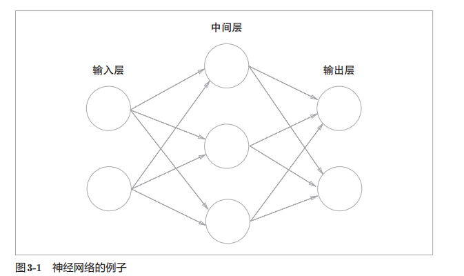
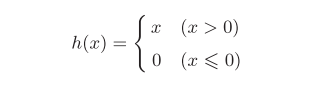
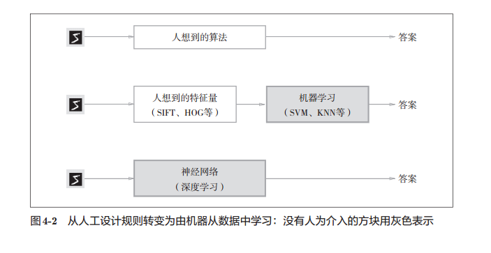

## 深度学习入门

每次被人问起是否会机器学习，神经网络或者深度学习就很尴尬。说不会吧，我确实是很早就开始学习机器学习的，花了不少功夫，也尝试着做了一些事情，手工写各种算法的实现，也试着手工实现多层网络和反向传播算法。但是，你说真的会吗？我是真的不会，我根本就没有使用机器学习或者深度学习解决实际问题的能力，也从来没有亲手训练过任何深度学习网络。

所以，最近心情不太好，也藉着一次帮别人做神经网络作业的机会，我来认真试一试学一下？

也不知道能走到哪一步。

现在使用的参考书是：深度学习入门基于python的理论和实现

所以，这里面会有一些图直接摘自这本书，毕竟自己画着好麻烦。

### 感知机

感知机是有多简单自不必提：
$$
y = f(W^TX)
$$
可视化之后，可以知道异或门的空间是无法线性可分的，而单层感知机的分界是线性的，这就是单层感知机的局限。

可以知道，单层感知机局限性很大，而多层感知机可以扩展功能，那么我们自然会想知道，我们想实现一个复杂的任务时，需要多少层呢？理论证明使用了非线性的sigmoid函数的2层感知机可以表示任意函数。

但是，据说层数多一些的话，会比较简单？

### 关于结构

这个不算什么重要的事情，习惯上常常会这样表示一个神经网络，在这样的图里面圆圈代表数据，箭头上才写着权重数据，所以，数据是有三层的，权重只有两层，因此有人称之三层网络，有人称之两层。当然，激活函数实际上也隐藏在中间层和输出层的圆圈中。

激活函数的两种常见形式是阶跃函数和sigmoid函数就自不必说了。

但是这是两种历史上常用的函数，现在常用的函数叫做Rectified Linear Unit，即线性整流函数或者修正线性单元，常称为ReLU函数，这个函数的表达式是：

另一种常用于输出层的函数是softmax函数，

其实很简单了，基本上是向量的e指数的单位化

需要注意的问题是softmax函数因为有e指数，所以容易溢出，那么我们将分子分母同时乘上相同数保持不变，也就是可以给$a_i$加上C，做一下缩放，一种策略是减去各个分量中的最大值。

一个重要的优点是，softmax的结果明显和为1，那么解释为概率就会比较简单。

其实，可以发现softmax是一个单调函数，那么实际上在鉴别哪个输出值最大的时候，过不过一层softmax无所谓，没差的。那么也就意味着输出层的softmax函数一般都会被忽略。

### 输出层单元数设定

当处理分类问题的时候，输出层的单元数一般会被设定为和类别数一致。

### 名词解释

one-hot-lable，这是一种真值表示方法，在分类问题中，例如手写数字识别，假设就3个数字，一种真值表示方法是1,2,3，另一种是[1,0,0],[0,1,0],[0,0,1]。后者就叫做one-hot

正规化预处理，对于输入数据可能会做一些与处理工作，其中一种可能的就是正规化，所谓正规化，指的是将数据限制在特定范围内，MNIST数据集我们已知像素值肯定是在0到255，但是也可以使用除掉255的方式限制在0到1之间。 预处理被证明是一种深度学习中很实用的方法，有效性已经得到很多验证，常见的一些处理例如利用整体的均值或者标准差移动数据，让数据整体以0为中心分布，还有让数据整体的分布形状均匀化的方法，即所谓数据白化。

批处理：我们将图像展开为一维向量，那么可以以二维数组的形式一次性将多张图片输入，明显经过前向传播可以一次性的得到全部图片的结果，这种方式叫做批处理。

机器学习问题的处理：我们知道从数据中解决问题无非三种模式：

这些就是他们的区别，也因此称深度学习是端到端的学习。

所谓训练集，测试集，泛化能力，过拟合，训练集也称监督数据就不必说了。

常用的损失函数是什么呢？自然，选择超级多。常用均方误差和交叉熵误差。

均方误差：

交叉熵误差：

学过信息论和传输熵的好吧，这些都一般了。

### mini-batch学习

当训练集很大的时候，对于全部数据计算损失函数超复杂，耗时太久。此时，从训练集中挑选一批，称之mini-batch，针对每一个批学习，这种叫做mini-batch学习

### Pytorch例子

在同学的建议下，我使用pytorch构建神经网络，这里给出几个参考资料，和一些我写的测试代码，作为日后参考。

